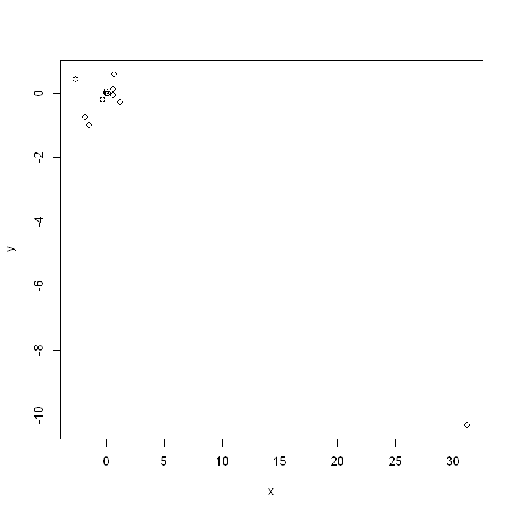

# Capitulo 3
## Santiago Espinoza
## René Delgado

# 3.1

Para la Tabla 3.4 La hipótesis nulea para cada predictor, ya sea TV, radio o periodico, dice que la cantidad de dinero invertida en estas no tiene efecto sobre el número de ventas. Los p-valores pequeños indican que la hipotesis nula se puede descartar en el caso de TV y radio. Como el p-valor de periodico es grande, se puede tomar su hipotesis nula como cierta.

# 3.2

La diferencia en entre la regresión por K vecinos cercanos con el clasificador de K vecinos cercanos, radica en el enfoque, durante la regresión estamos estimando y usando el promedio de los valores de y de los K vecinos más cercanos, en el clasificador se calcula la probabilidad condicional como 1/K por la cantidad de vecinos de una clase en particular, no se realiza nigún promedio.

# 3.3

Y = 50 + 20(GPA) + 0.07(IQ) + 35(Gender) + 0.01(GPA & IQ) - 10(GPA & Gender)  

tenemos:
male - gender = 0
Y = 50 + 20(GPA) + 0.07(IQ) + 0.01(GPA & IQ)  
female - gender = 0
Y = 50 + 20(GPA) + 0.07(IQ) + 35(Gender) + 0.01(GPA & IQ) - 10(GPA & Gender)  

a)

Si se tienen valores fijos de IQ y GPA, los hombres ganan mas que las mujeres dado un GPA lo suficientemente alto.

b)

Si IQ = 110 y GPA = 4.0

Y = 50 + 20(4.0) + 0.07(110) + 35(1) + 0.01(4 * 110) - 10(1 * 4.0)
Y = 137.1

c)

Falso, se debe tomar en cuenta el tamaño del p-valor del predicot par ver si este tiene algun efecto, o no, sobre la salida

# 3.4
**a)**
Dentro de la reresión cúbica se encuentra la regresión lineal. El RSS debe de mantenerse similar por lo mismo, tal vez siendo ligeramente menor el de la cúbica, los p-valores de los coeficientes cúbicos y cuadrático deben de resultar altos.
**b)**
El RSS del set de prueba para la estimación cúbica va a ser más alto que el de la estimación lineal, pues se puede aproximar una cúbica a una lineal en una localidad; sin embargo en los extremos se aleja del comportamiento lineal más y más. Además como teníamos más libertad en la curva existe la posibilidad de que se ajustara ligeramente al error en los datos de  entremiento empeorando aun más el RSS del set de prueba.
**c)**
En este caso el RSS de la regresión cúbica es mejor(menor) que el de la lineal.
**d)**
Considerando que el set de entrenamiento y de verificación están bien seleccionados, la predicción cúbica debe tener mejor RSS.

# 3.5


$$\hat y_i^´ = x_i \hat B$$

$$\hat B = \frac{\sum x_i y_i}{\sum x_k 2}$$

Sustituimos $\hat B$ en $\hat y_i$
$$
\hat y_i = x_i\frac{\sum {x_i}^´ {y_i}^´}{\sum x_k^2} = \sum({\frac{{x_i}^´ x_i}{\sum x_k^2}}){y_i}^´
$$
tomamos:
$$ a_i^´ = \frac{{x_i}^´ x_i}{\sum x_k^2}$$ y obtenemos:
$$ \hat y_i = \sum a_i^´ y_i^´$$

# 3.6
Tomando en cuenta:
$$\hat \beta_0 = \bar{y} - \hat\beta_1\bar{x}   $$

Es obvio que siempre para el promedio en x le corespondera el promedio en y.

# 3.7

Probar que: $$ R^2 = corr^2(x,y)$$
Tenemos que
$$ R^2 = \frac{TSS - RSS}{TSS}$$
donde
$$TSS = \sum (y_i - \bar y)^2$$
$$RSS = \sum (y_i - \hat y_i)^2$$
$$corr(x,y) = \frac{\sum(x_i - \bar x)(y_i - \bar y)}{\sigma_x \sigma_y}$$
$$\sigma_x^2 = \sum (x_i - \bar x)$$
$$\sigma_y^2 = \sum (y_i - \bar y)$$

Reemplazamos RSS y TSS en $R^2$
$$
R^2 = \frac{\sum (y_i - \bar{y})^2 - \sum (y_i - \hat{y}_i)^2}{\sum (y_i - \bar{y})^2} = \frac{\sum (\hat{y}_i - \bar{y})(2y_i - \bar{y} - \hat{y}_i)}{\sum (y_i - \bar{y})^2}
$$

Recordamos que:
$$
\begin{align}
  \hat{\beta}_0 &= \bar{y} - \hat{\beta}_1 \bar{x} \label{beta0} \\
  \hat{\beta}_1 &= \frac{\sum (x_i - \bar{x})(y_i - \bar{y})}
                        {\sum (x_j - \bar{x})^2}
\end{align}
$$

Subsittuimos $\hat \beta_0$ en $\hat y_i$
$$
\begin{align}
  \hat{y}_i &= \hat{\beta}_0 + \hat{\beta}_1 x_i \\
            &= \bar{y} - \hat{\beta}_1 \bar{x} + \hat{\beta}_1 x_i \\
            &= \bar{y} + \hat{\beta}_1 (x_i - \bar{x})
\end{align}
$$

Se toman las expresiones $\hat{y}_i - \bar{y}$ y $2y_i - \bar{y} - \hat{y}_i$ del numerador de $R^2$ y se hace un subsitucion de acuerdo a las expresiones anteriores
$$
\begin{align}
         \hat{y}_i - \bar{y} &= \hat{\beta}_1 (x_i - \bar{x}) \\
  2y_i - \bar{y} - \hat{y}_i &= 2y_i - \bar{y} - \bar{y} -
                                \hat{\beta}_1 (x_i - \bar{x}) \\
                             &= 2(y_i - \bar{y}) -
                                \hat{\beta}_1 (x_i - \bar{x})
\end{align}
$$
Se substituyen estas expresiones en el numerador de $R^2$
$$

   &= \sum \hat{\beta}_1 (x_i - \hat{x})
            \left[ 2(y_i - \bar{y}) - \hat{\beta}_1 (x_i - \bar{x}) \right] \\
    &= \hat{\beta}_1 \sum (x_i - \bar{x})
                          \left[ 2(y_i - \bar{y}) -
                                 \hat{\beta}_1 (x_i - \bar{x}) \right] \\
    &= \hat{\beta}_1
       \left[ 2 \sum (x_i - \bar{x})(y_i - \bar{y}) -
              \hat{\beta}_1 \sum (x_i - \bar{x})^2 \label{A4} \right]
\end{align}
$$

Usando la ecuacion para $\hat \beta_1$ se simplifica la expresion anterior y se obtiene
$$
\begin{align}
  A &= \hat{\beta}_1 \sum (x_i - \bar{x}) (y_i - \bar{y}) \\
    &= \frac{\left[ \sum (x_i - \bar{x}) (y_i - \bar{y}) \right]^2}
            {\sum (x_j - \bar{x})^2}
\end{align}
$$

Se reemplaza esto en el numerador de $R^2$ y se obtiene finalmente
$$
R^2 = \frac{\left[ \sum (x_i - \bar{x}) (y_i - \bar{y}) \right]^2}{\sum (x_j - \bar{x})^2 \sum (y_k - \bar{y})^2} = R^2 = corr^2(x, y)
$$
# 3.8

**a)**
Input:
```R
library(ISLR)
Auto <- na.omit(Auto)

reg_01 <- lm(mpg ~ horsepower, data = Auto)
summary(reg_01)
```
Output:
```R
Call:
lm(formula = mpg ~ horsepower, data = Auto)

Residuals:
     Min       1Q   Median       3Q      Max
-13.5710  -3.2592  -0.3435   2.7630  16.9240

Coefficients:
             Estimate Std. Error t value Pr(>|t|)
(Intercept) 39.935861   0.717499   55.66   <2e-16 ***
horsepower  -0.157845   0.006446  -24.49   <2e-16 ***
---
Signif. codes:  0 '***' 0.001 '**' 0.01 '*' 0.05 '.' 0.1 ' ' 1

Residual standard error: 4.906 on 390 degrees of freedom
Multiple R-squared:  0.6059,    Adjusted R-squared:  0.6049
F-statistic: 599.7 on 1 and 390 DF,  p-value: < 2.2e-16
```
Primero fijándonos en los p valores se observa que si existe una relación, no muy fuerte pues el valor del coeficiente es ~-0.15, el valor absoluto de este con relación a la desviación estandar de ~7.8 es muy pequeño; además se observa una relación negativa.

Realizando predicciones para el valor de 98 en horsepower:
```R
pred1 <- predict(reg_01, data.frame(horsepower = c(98)),interval='confidence')
print(pred1)
pred2 <- predict(reg_01, data.frame(horsepower = c(98)),interval='prediction')
print(pred2)
```
El valor de la predicción es 24.46708, con intervalos de confianza de 23.97308 a 24.96108 e intervalos de predicción de
14.8094 a 34.12476.

**b)**

**c)**

Se obseva que más o menos si sigue una distribución normal sin embargo exceptuaando normal Q-Q el resto de las graficas no siguen el comportamiento dedibo. Esto es debido que la relación real no es lineal, es cuadrática.

# 3.9
a)


```R
library(ISLR)
attach(Auto)
pairs(Auto)
```


b)


```R
cor(subset(Auto, select=-name))
```


<table>
<caption>A matrix: 8 × 8 of type dbl</caption>
<thead>
	<tr><th></th><th scope=col>mpg</th><th scope=col>cylinders</th><th scope=col>displacement</th><th scope=col>horsepower</th><th scope=col>weight</th><th scope=col>acceleration</th><th scope=col>year</th><th scope=col>origin</th></tr>
</thead>
<tbody>
	<tr><th scope=row>mpg</th><td> 1.0000000</td><td>-0.7776175</td><td>-0.8051269</td><td>-0.7784268</td><td>-0.8322442</td><td> 0.4233285</td><td> 0.5805410</td><td> 0.5652088</td></tr>
	<tr><th scope=row>cylinders</th><td>-0.7776175</td><td> 1.0000000</td><td> 0.9508233</td><td> 0.8429834</td><td> 0.8975273</td><td>-0.5046834</td><td>-0.3456474</td><td>-0.5689316</td></tr>
	<tr><th scope=row>displacement</th><td>-0.8051269</td><td> 0.9508233</td><td> 1.0000000</td><td> 0.8972570</td><td> 0.9329944</td><td>-0.5438005</td><td>-0.3698552</td><td>-0.6145351</td></tr>
	<tr><th scope=row>horsepower</th><td>-0.7784268</td><td> 0.8429834</td><td> 0.8972570</td><td> 1.0000000</td><td> 0.8645377</td><td>-0.6891955</td><td>-0.4163615</td><td>-0.4551715</td></tr>
	<tr><th scope=row>weight</th><td>-0.8322442</td><td> 0.8975273</td><td> 0.9329944</td><td> 0.8645377</td><td> 1.0000000</td><td>-0.4168392</td><td>-0.3091199</td><td>-0.5850054</td></tr>
	<tr><th scope=row>acceleration</th><td> 0.4233285</td><td>-0.5046834</td><td>-0.5438005</td><td>-0.6891955</td><td>-0.4168392</td><td> 1.0000000</td><td> 0.2903161</td><td> 0.2127458</td></tr>
	<tr><th scope=row>year</th><td> 0.5805410</td><td>-0.3456474</td><td>-0.3698552</td><td>-0.4163615</td><td>-0.3091199</td><td> 0.2903161</td><td> 1.0000000</td><td> 0.1815277</td></tr>
	<tr><th scope=row>origin</th><td> 0.5652088</td><td>-0.5689316</td><td>-0.6145351</td><td>-0.4551715</td><td>-0.5850054</td><td> 0.2127458</td><td> 0.1815277</td><td> 1.0000000</td></tr>
</tbody>
</table>


c)


```R
lm.fit1 = lm(mpg~.-name, data=Auto)
summary(lm.fit1)
```

```R


    Call:
    lm(formula = mpg ~ . - name, data = Auto)

    Residuals:
        Min      1Q  Median      3Q     Max
    -9.5903 -2.1565 -0.1169  1.8690 13.0604

    Coefficients:
                   Estimate Std. Error t value Pr(>|t|)    
    (Intercept)  -17.218435   4.644294  -3.707  0.00024 ***
    cylinders     -0.493376   0.323282  -1.526  0.12780    
    displacement   0.019896   0.007515   2.647  0.00844 **
    horsepower    -0.016951   0.013787  -1.230  0.21963    
    weight        -0.006474   0.000652  -9.929  < 2e-16 ***
    acceleration   0.080576   0.098845   0.815  0.41548    
    year           0.750773   0.050973  14.729  < 2e-16 ***
    origin         1.426141   0.278136   5.127 4.67e-07 ***
    ---
    Signif. codes:  0 '***' 0.001 '**' 0.01 '*' 0.05 '.' 0.1 ' ' 1

    Residual standard error: 3.328 on 384 degrees of freedom
    Multiple R-squared:  0.8215,	Adjusted R-squared:  0.8182
    F-statistic: 252.4 on 7 and 384 DF,  p-value: < 2.2e-16
```


i. Si existe relacion entre los predictores y la respuesta. Si se observan los p-valores de algunos predictores, como weight,year, origin, se puede obervar que son muy pequeños y por tanto se puede negar la hipotesis nula. Tambien se tiene un valor de la estadística-F lejano de 1.

ii. Los predictores maás significativos son weight, year y origin.

iii. El coeficiente del predictor year nos dice que conforme pasan los años incrementa la eficiencia de los automoviles.

d)


```R
par(mfrow=c(2,2))
plot(lm.fit1)
plot(predict(lm.fit1), rstudent(lm.fit1))
```


Se observa una curvatura en el fit. En el plit de leverage, el punto 14 tiene un nivel alto de leverage. En el plot de student se observan datos arriba de 3, los cuales pueden ser valores atípicos.

e)


```R
lm.fit2 = lm(mpg~cylinders*displacement+displacement*weight)
summary(lm.fit2)
```
```R


    Call:
    lm(formula = mpg ~ cylinders * displacement + displacement *
        weight)

    Residuals:
         Min       1Q   Median       3Q      Max
    -13.2934  -2.5184  -0.3476   1.8399  17.7723

    Coefficients:
                             Estimate Std. Error t value Pr(>|t|)    
    (Intercept)             5.262e+01  2.237e+00  23.519  < 2e-16 ***
    cylinders               7.606e-01  7.669e-01   0.992    0.322    
    displacement           -7.351e-02  1.669e-02  -4.403 1.38e-05 ***
    weight                 -9.888e-03  1.329e-03  -7.438 6.69e-13 ***
    cylinders:displacement -2.986e-03  3.426e-03  -0.872    0.384    
    displacement:weight     2.128e-05  5.002e-06   4.254 2.64e-05 ***
    ---
    Signif. codes:  0 '***' 0.001 '**' 0.01 '*' 0.05 '.' 0.1 ' ' 1

    Residual standard error: 4.103 on 386 degrees of freedom
    Multiple R-squared:  0.7272,	Adjusted R-squared:  0.7237
    F-statistic: 205.8 on 5 and 386 DF,  p-value: < 2.2e-16
```


Se tomaron los pares con mayor correlacion, de acuerdo a la matriz de correlaciones. Se puede observar que los valores-p de la interacción entre desplazamiento y peso son pequeños, lo cual indica que sí es significativa. Para cylinders y displacement, el p-valor es grande, por tanto su interacción no es significativa.

f)


```R
#sqrt
lm.fit3 = lm(mpg~log(weight)+sqrt(horsepower)+acceleration+I(acceleration^2))
summary(lm.fit3)
par(mfrow=c(2,2))
plot(lm.fit3)
plot(predict(lm.fit3), rstudent(lm.fit3))
```
```R


    Call:
    lm(formula = mpg ~ log(weight) + sqrt(horsepower) + acceleration +
        I(acceleration^2))

    Residuals:
         Min       1Q   Median       3Q      Max
    -11.2932  -2.5082  -0.2237   2.0237  15.7650

    Coefficients:
                       Estimate Std. Error t value Pr(>|t|)    
    (Intercept)       178.30303   10.80451  16.503  < 2e-16 ***
    log(weight)       -14.74259    1.73994  -8.473 5.06e-16 ***
    sqrt(horsepower)   -1.85192    0.36005  -5.144 4.29e-07 ***
    acceleration       -2.19890    0.63903  -3.441 0.000643 ***
    I(acceleration^2)   0.06139    0.01857   3.305 0.001037 **
    ---
    Signif. codes:  0 '***' 0.001 '**' 0.01 '*' 0.05 '.' 0.1 ' ' 1

    Residual standard error: 3.99 on 387 degrees of freedom
    Multiple R-squared:  0.7414,	Adjusted R-squared:  0.7387
    F-statistic: 277.3 on 4 and 387 DF,  p-value: < 2.2e-16
```


```R
#log
lm.fit4<-lm(log(mpg)~cylinders+displacement+horsepower+weight+acceleration+year+origin,data=Auto)
summary(lm.fit4)
par(mfrow=c(2,2))
plot(lm.fit4)
plot(predict(lm.fit4),rstudent(lm.fit4))
```
```R


    Call:
    lm(formula = log(mpg) ~ cylinders + displacement + horsepower +
        weight + acceleration + year + origin, data = Auto)

    Residuals:
         Min       1Q   Median       3Q      Max
    -0.40955 -0.06533  0.00079  0.06785  0.33925

    Coefficients:
                   Estimate Std. Error t value Pr(>|t|)    
    (Intercept)   1.751e+00  1.662e-01  10.533  < 2e-16 ***
    cylinders    -2.795e-02  1.157e-02  -2.415  0.01619 *  
    displacement  6.362e-04  2.690e-04   2.365  0.01852 *  
    horsepower   -1.475e-03  4.935e-04  -2.989  0.00298 **
    weight       -2.551e-04  2.334e-05 -10.931  < 2e-16 ***
    acceleration -1.348e-03  3.538e-03  -0.381  0.70339    
    year          2.958e-02  1.824e-03  16.211  < 2e-16 ***
    origin        4.071e-02  9.955e-03   4.089 5.28e-05 ***
    ---
    Signif. codes:  0 '***' 0.001 '**' 0.01 '*' 0.05 '.' 0.1 ' ' 1

    Residual standard error: 0.1191 on 384 degrees of freedom
    Multiple R-squared:  0.8795,	Adjusted R-squared:  0.8773
    F-statistic: 400.4 on 7 and 384 DF,  p-value: < 2.2e-16
```


# 3.10
***a)***
Input:
```R
library(ISLR)
Carseats <- na.omit(Carseats)

reg1 <- lm(Sales ~ US + Urban +Price, data=Carseats)
summary(reg1)
```
Output:
```R
Call:
lm(formula = Sales ~ US + Urban + Price, data = Carseats)

Residuals:
    Min      1Q  Median      3Q     Max
-6.9206 -1.6220 -0.0564  1.5786  7.0581

Coefficients:
             Estimate Std. Error t value Pr(>|t|)
(Intercept) 13.043469   0.651012  20.036  < 2e-16 ***
USYes        1.200573   0.259042   4.635 4.86e-06 ***
UrbanYes    -0.021916   0.271650  -0.081    0.936
Price       -0.054459   0.005242 -10.389  < 2e-16 ***
---
Signif. codes:  0 '***' 0.001 '**' 0.01 '*' 0.05 '.' 0.1 ' ' 1

Residual standard error: 2.472 on 396 degrees of freedom
Multiple R-squared:  0.2393,    Adjusted R-squared:  0.2335
F-statistic: 41.52 on 3 and 396 DF,  p-value: < 2.2e-16
```
**b) y d)**
Se observa primero que UrbanYes tiene un valor p muy alto, por lo que no es relevante para el modelo. Además se observa que conforme el precio crece las ventas disminuyen y si la tienda es de estados unidos las ventas aumentan.
**c)**
$$
\hat y =
  \begin{cases}
    US = Urban =Yes & Intercept +  USYes +UrbanYes + Prices(x)
    \\
    US = Yes \: \& \: Urban = No & Intercept +  USYes + Prices(x)
    \\
    US = No \: \& \: Urban = Yes & Intercept +UrbanYes + Prices(x)
    \\
      US = No \: \& \: Urban = No & Intercept  + Prices(x)
  \end{cases}
$$
Donde x es el precio.

**e) y f)**
Input:
```R
reg2 <- lm(Sales ~ US + Price,data=Carseats)
summary(reg2)
par(mfrow = c(2, 2))
plot(reg2)
```
Output:
```R

Call:
lm(formula = Sales ~ US + Price, data = Carseats)

Residuals:
    Min      1Q  Median      3Q     Max
-6.9269 -1.6286 -0.0574  1.5766  7.0515

Coefficients:
            Estimate Std. Error t value Pr(>|t|)    
(Intercept) 13.03079    0.63098  20.652  < 2e-16 ***
USYes        1.19964    0.25846   4.641 4.71e-06 ***
Price       -0.05448    0.00523 -10.416  < 2e-16 ***
---
Signif. codes:  0 '***' 0.001 '**' 0.01 '*' 0.05 '.' 0.1 ' ' 1

Residual standard error: 2.469 on 397 degrees of freedom
Multiple R-squared:  0.2393,    Adjusted R-squared:  0.2354
F-statistic: 62.43 on 2 and 397 DF,  p-value: < 2.2e-16
```
Se observa que este modelo tienen un error practicamente igual al del modelo pasado.
**g)**
Los intevalos obtenidos usado la función:
```R
confint(reg2)
```
Fueron de ***11.79 a 14.271*** para el ***intercepto***, ***0.691 a 1.708*** para ***USYes*** y ***-0.065 a -0.442*** para ***Price***, redondeando a tres digitos.
**f)**

Existe un valor observable de la gráfica Residuals vs Leverage que tienen mucha influencia y está muy separado del resto de los valores, tal vez convenga eliminnar ese valor.
# 3.11
a)


```R
set.seed(1)
x = rnorm(100)
y = 2*x + rnorm(100)

lm.fit = lm(y~x+0)
summary(lm.fit)
```
```R


    Call:
    lm(formula = y ~ x + 0)

    Residuals:
        Min      1Q  Median      3Q     Max
    -1.9154 -0.6472 -0.1771  0.5056  2.3109

    Coefficients:
      Estimate Std. Error t value Pr(>|t|)    
    x   1.9939     0.1065   18.73   <2e-16 ***
    ---
    Signif. codes:  0 '***' 0.001 '**' 0.01 '*' 0.05 '.' 0.1 ' ' 1

    Residual standard error: 0.9586 on 99 degrees of freedom
    Multiple R-squared:  0.7798,	Adjusted R-squared:  0.7776
    F-statistic: 350.7 on 1 and 99 DF,  p-value: < 2.2e-16
```


El p-valor es pequeño y la estadistica F es lejana de 1, por tanto se puede negar la hipótesis núla.

b)


```R
lm.fit1 = lm(x~y+0)
summary(lm.fit1)
```
```R


    Call:
    lm(formula = x ~ y + 0)

    Residuals:
        Min      1Q  Median      3Q     Max
    -0.8699 -0.2368  0.1030  0.2858  0.8938

    Coefficients:
      Estimate Std. Error t value Pr(>|t|)    
    y  0.39111    0.02089   18.73   <2e-16 ***
    ---
    Signif. codes:  0 '***' 0.001 '**' 0.01 '*' 0.05 '.' 0.1 ' ' 1

    Residual standard error: 0.4246 on 99 degrees of freedom
    Multiple R-squared:  0.7798,	Adjusted R-squared:  0.7776
    F-statistic: 350.7 on 1 and 99 DF,  p-value: < 2.2e-16
```


Para el caso en que no se toma en cuenta el intercepto igual se puede descartar la hipótesis núla.

c)

$y = 2x + \epsilon$ se puede reescribir como $x = 0.5(y-\epsilon)$
Son la misma linea.

d)
tenemos
$\frac{\beta}{SE(\beta)}$  $\beta = \frac{\sum x_i y_i}{\sum x_i ^2}$  $SE(\beta) = \sqrt{\frac{(y_i - x_i \beta)^2}{(n-1)\sum x_i^2}}$
Reemplazando los valores de $\beta$ y $SE(\beta)$ en $t$ obtenemos
$$t= \frac{\sum x_i y_i}{\sum x_i ^2} \sqrt{\frac{(y_i - x_i \beta)^2}{(n-1)\sum x_i^2}}$$

Simplificando
$$\frac{\sqrt{n-1}\sum x_i y_i}{\sqrt{\sum x_i^2 \sum (y_i - x_i \beta)^2}}$$
$$\frac {\sqrt{n-1} \sum{x_i y_i}}
      {\sqrt{\sum{x_i^2} \sum{(y_i^2 - 2 \beta x_i y_i  + x_i^2 \beta^2)}}}$$
$$\frac {\sqrt{n-1} \sum{x_i y_i}}
      {\sqrt{\sum{x_i^2} \sum{y_i^2} -
            \sum{x_i^2} \beta (2 \sum{x_i y_i} - \beta \sum{x_i^2})}}$$
$$\frac {\sqrt{n-1} \sum{x_i y_i}}
      {\sqrt{\sum{x_i^2} \sum{y_i^2} -
            \sum{x_i y_i} (2 \sum{x_i y_i} - \sum{x_i y_i})}}$$
y se obtiene
$$t = \frac {\sqrt{n-1} \sum{x_i y_i}}
          {\sqrt{\sum{x_i^2} \sum{y_i^2} - (\sum{x_i y_i})^2 }}$$

comprobando con el ejemplo anterior se obtiene


```R
(sqrt(length(x)-1) * sum(x*y)) / (sqrt(sum(x*x) * sum(y*y) - (sum(x*y))^2))
```


18.7259319374486


El cual es el mismo t-valor de la regresion sin intercepto

e)

Hacer el intercambio de t(x,y) y t(y,x) da el mismo resultado.

$$ t(x,y) = t(y,x)$$

f)


```R
lm.fit2 = lm(x~y)
summary(lm.fit2)
```
```R


    Call:
    lm(formula = x ~ y)

    Residuals:
         Min       1Q   Median       3Q      Max
    -0.90848 -0.28101  0.06274  0.24570  0.85736

    Coefficients:
                Estimate Std. Error t value Pr(>|t|)    
    (Intercept)  0.03880    0.04266    0.91    0.365    
    y            0.38942    0.02099   18.56   <2e-16 ***
    ---
    Signif. codes:  0 '***' 0.001 '**' 0.01 '*' 0.05 '.' 0.1 ' ' 1

    Residual standard error: 0.4249 on 98 degrees of freedom
    Multiple R-squared:  0.7784,	Adjusted R-squared:  0.7762
    F-statistic: 344.3 on 1 and 98 DF,  p-value: < 2.2e-16
```


```R
lm.fit3 = lm(y~x)
summary(lm.fit3)
```
```R


    Call:
    lm(formula = y ~ x)

    Residuals:
        Min      1Q  Median      3Q     Max
    -1.8768 -0.6138 -0.1395  0.5394  2.3462

    Coefficients:
                Estimate Std. Error t value Pr(>|t|)    
    (Intercept) -0.03769    0.09699  -0.389    0.698    
    x            1.99894    0.10773  18.556   <2e-16 ***
    ---
    Signif. codes:  0 '***' 0.001 '**' 0.01 '*' 0.05 '.' 0.1 ' ' 1

    Residual standard error: 0.9628 on 98 degrees of freedom
    Multiple R-squared:  0.7784,	Adjusted R-squared:  0.7762
    F-statistic: 344.3 on 1 and 98 DF,  p-value: < 2.2e-16
```


los t-valores son iguales para ambos casos
# 3.12
**a)**
En el caso que:
$$ x_i^2 = y_i^2 $$
Para toda i.
***b) y c)***
Input:
```R
D = data.frame(y = 1:100,x = -(1:100))
D_2 = data.frame(y1 = 1:100,x1 = seq.int(1,200,2))
reg1_1 <- lm(y~x,data=D)
reg1_2 <- lm(x~y,data=D)
reg2_1 <- lm(y1~x1,data=D_2)
reg2_2 <- lm(x1~y1,data=D_2)
c(coefficients(reg1_1)[2],coefficients(reg1_2)[2],coefficients(reg2_1)[2],coefficients(reg2_2)[2])
```
Output:
```R
   x    y   x1   y1
-1.0 -1.0  0.5  2.0
```
# 3.13
a)


```R
set.seed(1)
x = rnorm(100)
```

b)


```R
eps = rnorm(100,0,sqrt(0.25))
```

c)


```R
y = - 1 + 0.5*x + eps
length(y)
```


100


y tiene longitud de 100, $\beta_0 = -1$ y $\beta_1 = 0.5$

d)


```R
plot(x, y)
```


Se observa una realción lineal con pendiente positiva.

e)


```R
lm.fit = lm(y~x)
summary(lm.fit)
```
```R


    Call:
    lm(formula = y ~ x)

    Residuals:
         Min       1Q   Median       3Q      Max
    -0.93842 -0.30688 -0.06975  0.26970  1.17309

    Coefficients:
                Estimate Std. Error t value Pr(>|t|)    
    (Intercept) -1.01885    0.04849 -21.010  < 2e-16 ***
    x            0.49947    0.05386   9.273 4.58e-15 ***
    ---
    Signif. codes:  0 '***' 0.001 '**' 0.01 '*' 0.05 '.' 0.1 ' ' 1

    Residual standard error: 0.4814 on 98 degrees of freedom
    Multiple R-squared:  0.4674,	Adjusted R-squared:  0.4619
    F-statistic: 85.99 on 1 and 98 DF,  p-value: 4.583e-15

```

Se tiene un modelo con un p-valor pequeño y una estadostica F lejana de 1. Se puede rechazar la hipótesis nula.

f)


```R
plot(x, y)
abline(lm.fit, lwd=3, col=2)
abline(-1, 0.5, lwd=3, col=1)
legend(-1, legend = c("model fit", "pop reg"), col=2:1, lwd=3)
```


```R
lm.fit_sq = lm(y~x+I(x^2))
summary(lm.fit_sq)
```
```R


    Call:
    lm(formula = y ~ x + I(x^2))

    Residuals:
         Min       1Q   Median       3Q      Max
    -0.98252 -0.31270 -0.06441  0.29014  1.13500

    Coefficients:
                Estimate Std. Error t value Pr(>|t|)    
    (Intercept) -0.97164    0.05883 -16.517  < 2e-16 ***
    x            0.50858    0.05399   9.420  2.4e-15 ***
    I(x^2)      -0.05946    0.04238  -1.403    0.164    
    ---
    Signif. codes:  0 '***' 0.001 '**' 0.01 '*' 0.05 '.' 0.1 ' ' 1

    Residual standard error: 0.479 on 97 degrees of freedom
    Multiple R-squared:  0.4779,	Adjusted R-squared:  0.4672
    F-statistic:  44.4 on 2 and 97 DF,  p-value: 2.038e-14
```


El valor de $R^2$ aumento ligeramente, sin embargo se tiene un p-valor muy grande.

h)


```R
set.seed(1)
eps1 = rnorm(100, 0, 0.125) #se disminuye var de 0.25 a 0.125
x1 = rnorm(100)
y1 = -1 + 0.5*x1 + eps1
plot(x1, y1)
lm.fit1 = lm(y1~x1)
summary(lm.fit1)
abline(lm.fit1, lwd=3, col=2)
abline(-1, 0.5, lwd=3, col=3)
legend(-1, legend = c("model fit", "pop. regression"), col=2:3, lwd=3)
```
```R


    Call:
    lm(formula = y1 ~ x1)

    Residuals:
         Min       1Q   Median       3Q      Max
    -0.29052 -0.07545  0.00067  0.07288  0.28664

    Coefficients:
                Estimate Std. Error t value Pr(>|t|)    
    (Intercept) -0.98639    0.01129  -87.34   <2e-16 ***
    x1           0.49988    0.01184   42.22   <2e-16 ***
    ---
    Signif. codes:  0 '***' 0.001 '**' 0.01 '*' 0.05 '.' 0.1 ' ' 1

    Residual standard error: 0.1128 on 98 degrees of freedom
    Multiple R-squared:  0.9479,	Adjusted R-squared:  0.9474
    F-statistic:  1782 on 1 and 98 DF,  p-value: < 2.2e-16

```


Se observo un aumento significativo en $R^2$ de 0.467 a 0.9479, y RSE disminuyó de 0.481 a 0.1128

i)


```R
set.seed(1)
eps2 = rnorm(100, 0, 0.5) #se disminuye var de 0.25 a 0.5
x2 = rnorm(100)
y2 = -1 + 0.5*x2 + eps2
plot(x2, y2)
lm.fit2 = lm(y2~x2)
summary(lm.fit2)
abline(lm.fit2, lwd=3, col=2)
abline(-1, 0.5, lwd=3, col=3)
legend(-1, legend = c("model fit", "pop. regression"), col=2:3, lwd=3)
```
```R


    Call:
    lm(formula = y2 ~ x2)

    Residuals:
         Min       1Q   Median       3Q      Max
    -1.16208 -0.30181  0.00268  0.29152  1.14658

    Coefficients:
                Estimate Std. Error t value Pr(>|t|)    
    (Intercept) -0.94557    0.04517  -20.93   <2e-16 ***
    x2           0.49953    0.04736   10.55   <2e-16 ***
    ---
    Signif. codes:  0 '***' 0.001 '**' 0.01 '*' 0.05 '.' 0.1 ' ' 1

    Residual standard error: 0.4514 on 98 degrees of freedom
    Multiple R-squared:  0.5317,	Adjusted R-squared:  0.5269
    F-statistic: 111.2 on 1 and 98 DF,  p-value: < 2.2e-16
```


$R^2$ aumentó de 0.467 a 0.5317 y RSE disminuyó de 0.481 a 0.4514

j)


```R
confint(lm.fit)
```


<table>
<caption>A matrix: 2 × 2 of type dbl</caption>
<thead>
	<tr><th></th><th scope=col>2.5 %</th><th scope=col>97.5 %</th></tr>
</thead>
<tbody>
	<tr><th scope=row>(Intercept)</th><td>-1.1150804</td><td>-0.9226122</td></tr>
	<tr><th scope=row>x</th><td> 0.3925794</td><td> 0.6063602</td></tr>
</tbody>
</table>


```R
confint(lm.fit1)
```


<table>
<caption>A matrix: 2 × 2 of type dbl</caption>
<thead>
	<tr><th></th><th scope=col>2.5 %</th><th scope=col>97.5 %</th></tr>
</thead>
<tbody>
	<tr><th scope=row>(Intercept)</th><td>-1.008805</td><td>-0.9639819</td></tr>
	<tr><th scope=row>x1</th><td> 0.476387</td><td> 0.5233799</td></tr>
</tbody>
</table>


```R
confint(lm.fit2)
```


<table>
<caption>A matrix: 2 × 2 of type dbl</caption>
<thead>
	<tr><th></th><th scope=col>2.5 %</th><th scope=col>97.5 %</th></tr>
</thead>
<tbody>
	<tr><th scope=row>(Intercept)</th><td>-1.0352203</td><td>-0.8559276</td></tr>
	<tr><th scope=row>x2</th><td> 0.4055479</td><td> 0.5935197</td></tr>
</tbody>
</table>

# 3.14
**a)**
$$ y=2 +2x_1+0.3x_2$$
Los coeficientes son .3 y 2.
**b)**
Al correr el comando cor se observa una correlación de 0.83.

Es visible existe una correlación.
**c) , d) y e)**
Input:
```R
set.seed(1)
x1 <- runif(100)
x2 <- 0.5*x1+rnorm(100)/10
y <- 2+2*x1+.3*x2+rnorm(100)
reg1 <- lm(y ~ x1+x2)
reg2 <- lm(y ~ x1)
reg3 <- lm(y ~ x2)
summary(reg1)
summary(reg2)
summary(reg3)
```
Output:
```R
Call:
lm(formula = y ~ x1 + x2)

Residuals:
    Min      1Q  Median      3Q     Max
-2.8311 -0.7273 -0.0537  0.6338  2.3359

Coefficients:
            Estimate Std. Error t value Pr(>|t|)    
(Intercept)   2.1305     0.2319   9.188 7.61e-15 ***
x1            1.4396     0.7212   1.996   0.0487 *  
x2            1.0097     1.1337   0.891   0.3754    
---
Signif. codes:  0 '***' 0.001 '**' 0.01 '*' 0.05 '.' 0.1 ' ' 1

Residual standard error: 1.056 on 97 degrees of freedom
Multiple R-squared:  0.2088,    Adjusted R-squared:  0.1925
F-statistic:  12.8 on 2 and 97 DF,  p-value: 1.164e-05


Call:
lm(formula = y ~ x1)

Residuals:
     Min       1Q   Median       3Q      Max
-2.89495 -0.66874 -0.07785  0.59221  2.45560

Coefficients:
            Estimate Std. Error t value Pr(>|t|)    
(Intercept)   2.1124     0.2307   9.155 8.27e-15 ***
x1            1.9759     0.3963   4.986 2.66e-06 ***
---
Signif. codes:  0 '***' 0.001 '**' 0.01 '*' 0.05 '.' 0.1 ' ' 1

Residual standard error: 1.055 on 98 degrees of freedom
Multiple R-squared:  0.2024,    Adjusted R-squared:  0.1942
F-statistic: 24.86 on 1 and 98 DF,  p-value: 2.661e-06


Call:
lm(formula = y ~ x2)

Residuals:
     Min       1Q   Median       3Q      Max
-2.62687 -0.75156 -0.03598  0.72383  2.44890

Coefficients:
            Estimate Std. Error t value Pr(>|t|)    
(Intercept)   2.3899     0.1949   12.26  < 2e-16 ***
x2            2.8996     0.6330    4.58 1.37e-05 ***
---
Signif. codes:  0 '***' 0.001 '**' 0.01 '*' 0.05 '.' 0.1 ' ' 1

Residual standard error: 1.072 on 98 degrees of freedom
Multiple R-squared:  0.1763,    Adjusted R-squared:  0.1679
F-statistic: 20.98 on 1 and 98 DF,  p-value: 1.366e-05

```
Se observa que en el primer modelo x1 tiene más relevancia que x2, después en los modelos subsecuentes se muestra que tienen relevancia x1 y x2 en su caso correspondiente, por lo que no es suficiente el primer modelo para descartar las hipótesis nula de ningún predictor en particular, y en cada modelo subsecuente es suficiente para afirmar la hipótesis nula del predictor contrario al usado en cada modelo.
**f)**
Los modelos no se contradicen, pues en el primero se muestra que en presencia de esos dos predictores uno no es relevante, eso no quiere decir que solo no sean relevantes.

**g)**
Input:
```R
x1=c(x1,.1)
x2=c(x2,.8)
y=c(y,6)
reg1_2 <- lm(y ~ x1+x2)
reg2_2 <- lm(y ~ x1)
reg3_2 <- lm(y ~ x2)
summary(reg1_2)
summary(reg2_2)
summary(reg3_2)
par(mfrow = c(3,4))
plot(reg1_2)
plot(reg2_2)
plot(reg3_2)

```
Output:
```R

Call:
lm(formula = y ~ x1 + x2)

Residuals:
     Min       1Q   Median       3Q      Max
-2.73348 -0.69318 -0.05263  0.66385  2.30619

Coefficients:
            Estimate Std. Error t value Pr(>|t|)    
(Intercept)   2.2267     0.2314   9.624 7.91e-16 ***
x1            0.5394     0.5922   0.911  0.36458    
x2            2.5146     0.8977   2.801  0.00614 **
---
Signif. codes:  0 '***' 0.001 '**' 0.01 '*' 0.05 '.' 0.1 ' ' 1

Residual standard error: 1.075 on 98 degrees of freedom
Multiple R-squared:  0.2188,    Adjusted R-squared:  0.2029
F-statistic: 13.72 on 2 and 98 DF,  p-value: 5.564e-06


Call:
lm(formula = y ~ x1)

Residuals:
    Min      1Q  Median      3Q     Max
-2.8897 -0.6556 -0.0909  0.5682  3.5665

Coefficients:
            Estimate Std. Error t value Pr(>|t|)    
(Intercept)   2.2569     0.2390   9.445 1.78e-15 ***
x1            1.7657     0.4124   4.282 4.29e-05 ***
---
Signif. codes:  0 '***' 0.001 '**' 0.01 '*' 0.05 '.' 0.1 ' ' 1

Residual standard error: 1.111 on 99 degrees of freedom
Multiple R-squared:  0.1562,    Adjusted R-squared:  0.1477
F-statistic: 18.33 on 1 and 99 DF,  p-value: 4.295e-05


Call:
lm(formula = y ~ x2)

Residuals:
     Min       1Q   Median       3Q      Max
-2.64729 -0.71021 -0.06899  0.72699  2.38074

Coefficients:
            Estimate Std. Error t value Pr(>|t|)    
(Intercept)   2.3451     0.1912  12.264  < 2e-16 ***
x2            3.1190     0.6040   5.164 1.25e-06 ***
---
Signif. codes:  0 '***' 0.001 '**' 0.01 '*' 0.05 '.' 0.1 ' ' 1

Residual standard error: 1.074 on 99 degrees of freedom
Multiple R-squared:  0.2122,    Adjusted R-squared:  0.2042
F-statistic: 26.66 on 1 and 99 DF,  p-value: 1.253e-06
```
En el primer modelo se observa que el predictor menos relevante cambió, ahora x2 es más relevate.
En los dos modelos subsecuentes no hay cambio importante aparte de un ligero aumento en el error.
Observando las graficas de los modelos en todas se nota una desviación en la gráfica de Residuals vs Leverage debido al punto recién introducido, siendo ligeramente menor el efecto en el segundo modelo.

Cabe resaltar que es en este segundo modelo que se usa x2 por lo que implica que existe una relación entre un Leverage menor y la relevancia en el modelo general del predictor en cuestión.

# 3.15
a)


```R
library(MASS)
attach(Boston)
lm.zn = lm(crim~zn) #crimen y zonas residenciales 25,000 sq ft
summary(lm.zn)
par(mfrow=c(2,2))
plot(lm.zn)
```
```R
    The following objects are masked from Boston (pos = 3):

        age, black, chas, crim, dis, indus, lstat, medv, nox, ptratio, rad,
        rm, tax, zn


    Call:
    lm(formula = crim ~ zn)

    Residuals:
       Min     1Q Median     3Q    Max
    -4.429 -4.222 -2.620  1.250 84.523

    Coefficients:
                Estimate Std. Error t value Pr(>|t|)    
    (Intercept)  4.45369    0.41722  10.675  < 2e-16 ***
    zn          -0.07393    0.01609  -4.594 5.51e-06 ***
    ---
    Signif. codes:  0 '***' 0.001 '**' 0.01 '*' 0.05 '.' 0.1 ' ' 1

    Residual standard error: 8.435 on 504 degrees of freedom
    Multiple R-squared:  0.04019,	Adjusted R-squared:  0.03828
    F-statistic:  21.1 on 1 and 504 DF,  p-value: 5.506e-06

```


```R
lm.indus = lm(crim~indus) #crimen y non retail business acres
summary(lm.indus)
par(mfrow=c(2,2))
#plot(lm.indus)
```
```R


    Call:
    lm(formula = crim ~ indus)

    Residuals:
        Min      1Q  Median      3Q     Max
    -11.972  -2.698  -0.736   0.712  81.813

    Coefficients:
                Estimate Std. Error t value Pr(>|t|)    
    (Intercept) -2.06374    0.66723  -3.093  0.00209 **
    indus        0.50978    0.05102   9.991  < 2e-16 ***
    ---
    Signif. codes:  0 '***' 0.001 '**' 0.01 '*' 0.05 '.' 0.1 ' ' 1

    Residual standard error: 7.866 on 504 degrees of freedom
    Multiple R-squared:  0.1653,	Adjusted R-squared:  0.1637
    F-statistic: 99.82 on 1 and 504 DF,  p-value: < 2.2e-16

```


```R
lm.chas = lm(crim~chas) #crimen y cercania al rio charles
summary(lm.chas)
par(mfrow=c(2,2))
plot(lm.chas)
```
```R


    Call:
    lm(formula = crim ~ chas)

    Residuals:
       Min     1Q Median     3Q    Max
    -3.738 -3.661 -3.435  0.018 85.232

    Coefficients:
                Estimate Std. Error t value Pr(>|t|)    
    (Intercept)   3.7444     0.3961   9.453   <2e-16 ***
    chas         -1.8928     1.5061  -1.257    0.209    
    ---
    Signif. codes:  0 '***' 0.001 '**' 0.01 '*' 0.05 '.' 0.1 ' ' 1

    Residual standard error: 8.597 on 504 degrees of freedom
    Multiple R-squared:  0.003124,	Adjusted R-squared:  0.001146
    F-statistic: 1.579 on 1 and 504 DF,  p-value: 0.2094

```


```R
lm.nox = lm(crim~nox) #crimen y concentraciones de oxidos de nitrogeno
summary(lm.nox)
par(mfrow=c(2,2))
#plot(lm.nox)
```
```R


    Call:
    lm(formula = crim ~ nox)

    Residuals:
        Min      1Q  Median      3Q     Max
    -12.371  -2.738  -0.974   0.559  81.728

    Coefficients:
                Estimate Std. Error t value Pr(>|t|)    
    (Intercept)  -13.720      1.699  -8.073 5.08e-15 ***
    nox           31.249      2.999  10.419  < 2e-16 ***
    ---
    Signif. codes:  0 '***' 0.001 '**' 0.01 '*' 0.05 '.' 0.1 ' ' 1

    Residual standard error: 7.81 on 504 degrees of freedom
    Multiple R-squared:  0.1772,	Adjusted R-squared:  0.1756
    F-statistic: 108.6 on 1 and 504 DF,  p-value: < 2.2e-16

```


```R
lm.rm = lm(crim~rm) #crimen y numero promedio de habitaciones por vivienda
summary(lm.rm)
par(mfrow=c(2,2))
#plot(lm.rm)
```
```R


    Call:
    lm(formula = crim ~ rm)

    Residuals:
       Min     1Q Median     3Q    Max
    -6.604 -3.952 -2.654  0.989 87.197

    Coefficients:
                Estimate Std. Error t value Pr(>|t|)    
    (Intercept)   20.482      3.365   6.088 2.27e-09 ***
    rm            -2.684      0.532  -5.045 6.35e-07 ***
    ---
    Signif. codes:  0 '***' 0.001 '**' 0.01 '*' 0.05 '.' 0.1 ' ' 1

    Residual standard error: 8.401 on 504 degrees of freedom
    Multiple R-squared:  0.04807,	Adjusted R-squared:  0.04618
    F-statistic: 25.45 on 1 and 504 DF,  p-value: 6.347e-07

```


```R
lm.age = lm(crim~age) #crimen y edad del edificio
summary(lm.age)
par(mfrow=c(2,2))
#plot(lm.age)
```
```R


    Call:
    lm(formula = crim ~ age)

    Residuals:
       Min     1Q Median     3Q    Max
    -6.789 -4.257 -1.230  1.527 82.849

    Coefficients:
                Estimate Std. Error t value Pr(>|t|)    
    (Intercept) -3.77791    0.94398  -4.002 7.22e-05 ***
    age          0.10779    0.01274   8.463 2.85e-16 ***
    ---
    Signif. codes:  0 '***' 0.001 '**' 0.01 '*' 0.05 '.' 0.1 ' ' 1

    Residual standard error: 8.057 on 504 degrees of freedom
    Multiple R-squared:  0.1244,	Adjusted R-squared:  0.1227
    F-statistic: 71.62 on 1 and 504 DF,  p-value: 2.855e-16
```


```R
lm.dis = lm(crim~dis) #crimen y distancia a entros de empleo
summary(lm.dis)
par(mfrow=c(2,2))
#plot(lm.dis)
```
```R


    Call:
    lm(formula = crim ~ dis)

    Residuals:
       Min     1Q Median     3Q    Max
    -6.708 -4.134 -1.527  1.516 81.674

    Coefficients:
                Estimate Std. Error t value Pr(>|t|)    
    (Intercept)   9.4993     0.7304  13.006   <2e-16 ***
    dis          -1.5509     0.1683  -9.213   <2e-16 ***
    ---
    Signif. codes:  0 '***' 0.001 '**' 0.01 '*' 0.05 '.' 0.1 ' ' 1

    Residual standard error: 7.965 on 504 degrees of freedom
    Multiple R-squared:  0.1441,	Adjusted R-squared:  0.1425
    F-statistic: 84.89 on 1 and 504 DF,  p-value: < 2.2e-16

```


```R
lm.rad = lm(crim~rad) #crimen y cercania a carreteras
summary(lm.rad)
par(mfrow=c(2,2))
#plot(lm.rad)
```
```R


    Call:
    lm(formula = crim ~ rad)

    Residuals:
        Min      1Q  Median      3Q     Max
    -10.164  -1.381  -0.141   0.660  76.433

    Coefficients:
                Estimate Std. Error t value Pr(>|t|)    
    (Intercept) -2.28716    0.44348  -5.157 3.61e-07 ***
    rad          0.61791    0.03433  17.998  < 2e-16 ***
    ---
    Signif. codes:  0 '***' 0.001 '**' 0.01 '*' 0.05 '.' 0.1 ' ' 1

    Residual standard error: 6.718 on 504 degrees of freedom
    Multiple R-squared:  0.3913,	Adjusted R-squared:   0.39
    F-statistic: 323.9 on 1 and 504 DF,  p-value: < 2.2e-16

```


```R
lm.tax = lm(crim~tax) #crimen e impuestos
summary(lm.tax)
par(mfrow=c(2,2))
#plot(lm.tax)
```
```R


    Call:
    lm(formula = crim ~ tax)

    Residuals:
        Min      1Q  Median      3Q     Max
    -12.513  -2.738  -0.194   1.065  77.696

    Coefficients:
                 Estimate Std. Error t value Pr(>|t|)    
    (Intercept) -8.528369   0.815809  -10.45   <2e-16 ***
    tax          0.029742   0.001847   16.10   <2e-16 ***
    ---
    Signif. codes:  0 '***' 0.001 '**' 0.01 '*' 0.05 '.' 0.1 ' ' 1

    Residual standard error: 6.997 on 504 degrees of freedom
    Multiple R-squared:  0.3396,	Adjusted R-squared:  0.3383
    F-statistic: 259.2 on 1 and 504 DF,  p-value: < 2.2e-16

```


```R
lm.ptratio = lm(crim~ptratio) #crimen y taza de maestros promedio
summary(lm.ptratio)
par(mfrow=c(2,2))
#plot(lm.ptratio)
```

```R

    Call:
    lm(formula = crim ~ ptratio)

    Residuals:
       Min     1Q Median     3Q    Max
    -7.654 -3.985 -1.912  1.825 83.353

    Coefficients:
                Estimate Std. Error t value Pr(>|t|)    
    (Intercept) -17.6469     3.1473  -5.607 3.40e-08 ***
    ptratio       1.1520     0.1694   6.801 2.94e-11 ***
    ---
    Signif. codes:  0 '***' 0.001 '**' 0.01 '*' 0.05 '.' 0.1 ' ' 1

    Residual standard error: 8.24 on 504 degrees of freedom
    Multiple R-squared:  0.08407,	Adjusted R-squared:  0.08225
    F-statistic: 46.26 on 1 and 504 DF,  p-value: 2.943e-11
```

```R
lm.black = lm(crim~black) #crimen y poblacion de afro americanos
summary(lm.black)
par(mfrow=c(2,2))
#plot(lm.black)
```
```R


    Call:
    lm(formula = crim ~ black)

    Residuals:
        Min      1Q  Median      3Q     Max
    -13.756  -2.299  -2.095  -1.296  86.822

    Coefficients:
                 Estimate Std. Error t value Pr(>|t|)    
    (Intercept) 16.553529   1.425903  11.609   <2e-16 ***
    black       -0.036280   0.003873  -9.367   <2e-16 ***
    ---
    Signif. codes:  0 '***' 0.001 '**' 0.01 '*' 0.05 '.' 0.1 ' ' 1

    Residual standard error: 7.946 on 504 degrees of freedom
    Multiple R-squared:  0.1483,	Adjusted R-squared:  0.1466
    F-statistic: 87.74 on 1 and 504 DF,  p-value: < 2.2e-16
```


```R
lm.lstat = lm(crim~lstat) #crimen y porcentaje de poblacion de status bajo
summary(lm.lstat)
par(mfrow=c(2,2))
#plot(lm.lstat)
```

```R

    Call:
    lm(formula = crim ~ lstat)

    Residuals:
        Min      1Q  Median      3Q     Max
    -13.925  -2.822  -0.664   1.079  82.862

    Coefficients:
                Estimate Std. Error t value Pr(>|t|)    
    (Intercept) -3.33054    0.69376  -4.801 2.09e-06 ***
    lstat        0.54880    0.04776  11.491  < 2e-16 ***
    ---
    Signif. codes:  0 '***' 0.001 '**' 0.01 '*' 0.05 '.' 0.1 ' ' 1

    Residual standard error: 7.664 on 504 degrees of freedom
    Multiple R-squared:  0.2076,	Adjusted R-squared:  0.206
    F-statistic:   132 on 1 and 504 DF,  p-value: < 2.2e-16

```


```R
lm.medv = lm(crim~medv) #crimen y valo medio de casas ocupadas en $1000s
summary(lm.medv)
par(mfrow=c(2,2))
#plot(lm.medv)
```

```R

    Call:
    lm(formula = crim ~ medv)

    Residuals:
       Min     1Q Median     3Q    Max
    -9.071 -4.022 -2.343  1.298 80.957

    Coefficients:
                Estimate Std. Error t value Pr(>|t|)    
    (Intercept) 11.79654    0.93419   12.63   <2e-16 ***
    medv        -0.36316    0.03839   -9.46   <2e-16 ***
    ---
    Signif. codes:  0 '***' 0.001 '**' 0.01 '*' 0.05 '.' 0.1 ' ' 1

    Residual standard error: 7.934 on 504 degrees of freedom
    Multiple R-squared:  0.1508,	Adjusted R-squared:  0.1491
    F-statistic: 89.49 on 1 and 504 DF,  p-value: < 2.2e-16

```

No se pudo hacer regresion con el parametro chas ya que este es cualitativo.
Basado en los valores de la estadistica - F algunso de los predicotres más significativos son nox, rad y tax.

b)


```R
lm.all = lm(crim~., data=Boston) #crimen y todos los predictores
summary(lm.all)
```
```R


    Call:
    lm(formula = crim ~ ., data = Boston)

    Residuals:
       Min     1Q Median     3Q    Max
    -9.924 -2.120 -0.353  1.019 75.051

    Coefficients:
                  Estimate Std. Error t value Pr(>|t|)    
    (Intercept)  17.033228   7.234903   2.354 0.018949 *  
    zn            0.044855   0.018734   2.394 0.017025 *  
    indus        -0.063855   0.083407  -0.766 0.444294    
    chas         -0.749134   1.180147  -0.635 0.525867    
    nox         -10.313535   5.275536  -1.955 0.051152 .  
    rm            0.430131   0.612830   0.702 0.483089    
    age           0.001452   0.017925   0.081 0.935488    
    dis          -0.987176   0.281817  -3.503 0.000502 ***
    rad           0.588209   0.088049   6.680 6.46e-11 ***
    tax          -0.003780   0.005156  -0.733 0.463793    
    ptratio      -0.271081   0.186450  -1.454 0.146611    
    black        -0.007538   0.003673  -2.052 0.040702 *  
    lstat         0.126211   0.075725   1.667 0.096208 .  
    medv         -0.198887   0.060516  -3.287 0.001087 **
    ---
    Signif. codes:  0 '***' 0.001 '**' 0.01 '*' 0.05 '.' 0.1 ' ' 1

    Residual standard error: 6.439 on 492 degrees of freedom
    Multiple R-squared:  0.454,	Adjusted R-squared:  0.4396
    F-statistic: 31.47 on 13 and 492 DF,  p-value: < 2.2e-16

```

Los predictores dis,rad y medv tiene p-valores más pequeños comparados con los demás, por tanto se puede descartar la hipotesus núla en estos.

c)


```R
x = c(coefficients(lm.zn)[2],
      coefficients(lm.indus)[2],
      coefficients(lm.chas)[2],
      coefficients(lm.nox)[2],
      coefficients(lm.rm)[2],
      coefficients(lm.age)[2],
      coefficients(lm.dis)[2],
      coefficients(lm.rad)[2],
      coefficients(lm.tax)[2],
      coefficients(lm.ptratio)[2],
      coefficients(lm.black)[2],
      coefficients(lm.lstat)[2],
      coefficients(lm.medv)[2])

y = coefficients(lm.all)[2:14]
plot(x, y)
```





El coeficiente para nox es diferente en regresion simple (-10 )y regresion multiple (30).

d)


```R
lm.zn = lm(crim~poly(zn,3))
summary(lm.zn)
```
```R


    Call:
    lm(formula = crim ~ poly(zn, 3))

    Residuals:
       Min     1Q Median     3Q    Max
    -4.821 -4.614 -1.294  0.473 84.130

    Coefficients:
                 Estimate Std. Error t value Pr(>|t|)    
    (Intercept)    3.6135     0.3722   9.709  < 2e-16 ***
    poly(zn, 3)1 -38.7498     8.3722  -4.628  4.7e-06 ***
    poly(zn, 3)2  23.9398     8.3722   2.859  0.00442 **
    poly(zn, 3)3 -10.0719     8.3722  -1.203  0.22954    
    ---
    Signif. codes:  0 '***' 0.001 '**' 0.01 '*' 0.05 '.' 0.1 ' ' 1

    Residual standard error: 8.372 on 502 degrees of freedom
    Multiple R-squared:  0.05824,	Adjusted R-squared:  0.05261
    F-statistic: 10.35 on 3 and 502 DF,  p-value: 1.281e-06


```
```R
lm.indus = lm(crim~poly(indus,3))
summary(lm.indus)
```

```R

    Call:
    lm(formula = crim ~ poly(indus, 3))

    Residuals:
       Min     1Q Median     3Q    Max
    -8.278 -2.514  0.054  0.764 79.713

    Coefficients:
                    Estimate Std. Error t value Pr(>|t|)    
    (Intercept)        3.614      0.330  10.950  < 2e-16 ***
    poly(indus, 3)1   78.591      7.423  10.587  < 2e-16 ***
    poly(indus, 3)2  -24.395      7.423  -3.286  0.00109 **
    poly(indus, 3)3  -54.130      7.423  -7.292  1.2e-12 ***
    ---
    Signif. codes:  0 '***' 0.001 '**' 0.01 '*' 0.05 '.' 0.1 ' ' 1

    Residual standard error: 7.423 on 502 degrees of freedom
    Multiple R-squared:  0.2597,	Adjusted R-squared:  0.2552
    F-statistic: 58.69 on 3 and 502 DF,  p-value: < 2.2e-16

```


```R
lm.nox = lm(crim~poly(nox,3))
summary(lm.nox)
```

```R
    Call:
    lm(formula = crim ~ poly(nox, 3))

    Residuals:
       Min     1Q Median     3Q    Max
    -9.110 -2.068 -0.255  0.739 78.302

    Coefficients:
                  Estimate Std. Error t value Pr(>|t|)    
    (Intercept)     3.6135     0.3216  11.237  < 2e-16 ***
    poly(nox, 3)1  81.3720     7.2336  11.249  < 2e-16 ***
    poly(nox, 3)2 -28.8286     7.2336  -3.985 7.74e-05 ***
    poly(nox, 3)3 -60.3619     7.2336  -8.345 6.96e-16 ***
    ---
    Signif. codes:  0 '***' 0.001 '**' 0.01 '*' 0.05 '.' 0.1 ' ' 1

    Residual standard error: 7.234 on 502 degrees of freedom
    Multiple R-squared:  0.297,	Adjusted R-squared:  0.2928
    F-statistic: 70.69 on 3 and 502 DF,  p-value: < 2.2e-16

```


```R
lm.rm = lm(crim~poly(rm,3))
summary(lm.rm)
```

```R

    Call:
    lm(formula = crim ~ poly(rm, 3))

    Residuals:
        Min      1Q  Median      3Q     Max
    -18.485  -3.468  -2.221  -0.015  87.219

    Coefficients:
                 Estimate Std. Error t value Pr(>|t|)    
    (Intercept)    3.6135     0.3703   9.758  < 2e-16 ***
    poly(rm, 3)1 -42.3794     8.3297  -5.088 5.13e-07 ***
    poly(rm, 3)2  26.5768     8.3297   3.191  0.00151 **
    poly(rm, 3)3  -5.5103     8.3297  -0.662  0.50858    
    ---
    Signif. codes:  0 '***' 0.001 '**' 0.01 '*' 0.05 '.' 0.1 ' ' 1

    Residual standard error: 8.33 on 502 degrees of freedom
    Multiple R-squared:  0.06779,	Adjusted R-squared:  0.06222
    F-statistic: 12.17 on 3 and 502 DF,  p-value: 1.067e-07

```


```R
lm.age = lm(crim~poly(age,3))
summary(lm.age)
```

```R

    Call:
    lm(formula = crim ~ poly(age, 3))

    Residuals:
       Min     1Q Median     3Q    Max
    -9.762 -2.673 -0.516  0.019 82.842

    Coefficients:
                  Estimate Std. Error t value Pr(>|t|)    
    (Intercept)     3.6135     0.3485  10.368  < 2e-16 ***
    poly(age, 3)1  68.1820     7.8397   8.697  < 2e-16 ***
    poly(age, 3)2  37.4845     7.8397   4.781 2.29e-06 ***
    poly(age, 3)3  21.3532     7.8397   2.724  0.00668 **
    ---
    Signif. codes:  0 '***' 0.001 '**' 0.01 '*' 0.05 '.' 0.1 ' ' 1

    Residual standard error: 7.84 on 502 degrees of freedom
    Multiple R-squared:  0.1742,	Adjusted R-squared:  0.1693
    F-statistic: 35.31 on 3 and 502 DF,  p-value: < 2.2e-16

```


```R
lm.dis = lm(crim~poly(dis,3))
summary(lm.dis)
```

```R

    Call:
    lm(formula = crim ~ poly(dis, 3))

    Residuals:
        Min      1Q  Median      3Q     Max
    -10.757  -2.588   0.031   1.267  76.378

    Coefficients:
                  Estimate Std. Error t value Pr(>|t|)    
    (Intercept)     3.6135     0.3259  11.087  < 2e-16 ***
    poly(dis, 3)1 -73.3886     7.3315 -10.010  < 2e-16 ***
    poly(dis, 3)2  56.3730     7.3315   7.689 7.87e-14 ***
    poly(dis, 3)3 -42.6219     7.3315  -5.814 1.09e-08 ***
    ---
    Signif. codes:  0 '***' 0.001 '**' 0.01 '*' 0.05 '.' 0.1 ' ' 1

    Residual standard error: 7.331 on 502 degrees of freedom
    Multiple R-squared:  0.2778,	Adjusted R-squared:  0.2735
    F-statistic: 64.37 on 3 and 502 DF,  p-value: < 2.2e-16

```


```R
lm.rad = lm(crim~poly(rad,3))
summary(lm.rad)
```

```R

    Call:
    lm(formula = crim ~ poly(rad, 3))

    Residuals:
        Min      1Q  Median      3Q     Max
    -10.381  -0.412  -0.269   0.179  76.217

    Coefficients:
                  Estimate Std. Error t value Pr(>|t|)    
    (Intercept)     3.6135     0.2971  12.164  < 2e-16 ***
    poly(rad, 3)1 120.9074     6.6824  18.093  < 2e-16 ***
    poly(rad, 3)2  17.4923     6.6824   2.618  0.00912 **
    poly(rad, 3)3   4.6985     6.6824   0.703  0.48231    
    ---
    Signif. codes:  0 '***' 0.001 '**' 0.01 '*' 0.05 '.' 0.1 ' ' 1

    Residual standard error: 6.682 on 502 degrees of freedom
    Multiple R-squared:    0.4,	Adjusted R-squared:  0.3965
    F-statistic: 111.6 on 3 and 502 DF,  p-value: < 2.2e-16

```


```R
lm.tax = lm(crim~poly(tax,3))
summary(lm.tax)
```

```R

    Call:
    lm(formula = crim ~ poly(tax, 3))

    Residuals:
        Min      1Q  Median      3Q     Max
    -13.273  -1.389   0.046   0.536  76.950

    Coefficients:
                  Estimate Std. Error t value Pr(>|t|)    
    (Intercept)     3.6135     0.3047  11.860  < 2e-16 ***
    poly(tax, 3)1 112.6458     6.8537  16.436  < 2e-16 ***
    poly(tax, 3)2  32.0873     6.8537   4.682 3.67e-06 ***
    poly(tax, 3)3  -7.9968     6.8537  -1.167    0.244    
    ---
    Signif. codes:  0 '***' 0.001 '**' 0.01 '*' 0.05 '.' 0.1 ' ' 1

    Residual standard error: 6.854 on 502 degrees of freedom
    Multiple R-squared:  0.3689,	Adjusted R-squared:  0.3651
    F-statistic:  97.8 on 3 and 502 DF,  p-value: < 2.2e-16

```


```R
lm.ptratio = lm(crim~poly(ptratio,3))
summary(lm.ptratio)
```
```R


    Call:
    lm(formula = crim ~ poly(ptratio, 3))

    Residuals:
       Min     1Q Median     3Q    Max
    -6.833 -4.146 -1.655  1.408 82.697

    Coefficients:
                      Estimate Std. Error t value Pr(>|t|)    
    (Intercept)          3.614      0.361  10.008  < 2e-16 ***
    poly(ptratio, 3)1   56.045      8.122   6.901 1.57e-11 ***
    poly(ptratio, 3)2   24.775      8.122   3.050  0.00241 **
    poly(ptratio, 3)3  -22.280      8.122  -2.743  0.00630 **
    ---
    Signif. codes:  0 '***' 0.001 '**' 0.01 '*' 0.05 '.' 0.1 ' ' 1

    Residual standard error: 8.122 on 502 degrees of freedom
    Multiple R-squared:  0.1138,	Adjusted R-squared:  0.1085
    F-statistic: 21.48 on 3 and 502 DF,  p-value: 4.171e-13

```


```R
lm.black = lm(crim~poly(black,3))
summary(lm.black)
```

```R

    Call:
    lm(formula = crim ~ poly(black, 3))

    Residuals:
        Min      1Q  Median      3Q     Max
    -13.096  -2.343  -2.128  -1.439  86.790

    Coefficients:
                    Estimate Std. Error t value Pr(>|t|)    
    (Intercept)       3.6135     0.3536  10.218   <2e-16 ***
    poly(black, 3)1 -74.4312     7.9546  -9.357   <2e-16 ***
    poly(black, 3)2   5.9264     7.9546   0.745    0.457    
    poly(black, 3)3  -4.8346     7.9546  -0.608    0.544    
    ---
    Signif. codes:  0 '***' 0.001 '**' 0.01 '*' 0.05 '.' 0.1 ' ' 1

    Residual standard error: 7.955 on 502 degrees of freedom
    Multiple R-squared:  0.1498,	Adjusted R-squared:  0.1448
    F-statistic: 29.49 on 3 and 502 DF,  p-value: < 2.2e-16

```


```R
lm.lstat = lm(crim~poly(lstat,3))
summary(lm.lstat)
```
```R


    Call:
    lm(formula = crim ~ poly(lstat, 3))

    Residuals:
        Min      1Q  Median      3Q     Max
    -15.234  -2.151  -0.486   0.066  83.353

    Coefficients:
                    Estimate Std. Error t value Pr(>|t|)    
    (Intercept)       3.6135     0.3392  10.654   <2e-16 ***
    poly(lstat, 3)1  88.0697     7.6294  11.543   <2e-16 ***
    poly(lstat, 3)2  15.8882     7.6294   2.082   0.0378 *  
    poly(lstat, 3)3 -11.5740     7.6294  -1.517   0.1299    
    ---
    Signif. codes:  0 '***' 0.001 '**' 0.01 '*' 0.05 '.' 0.1 ' ' 1

    Residual standard error: 7.629 on 502 degrees of freedom
    Multiple R-squared:  0.2179,	Adjusted R-squared:  0.2133
    F-statistic: 46.63 on 3 and 502 DF,  p-value: < 2.2e-16
```


```R
lm.medv = lm(crim~poly(medv,3))
summary(lm.medv)
```

```R

    Call:
    lm(formula = crim ~ poly(medv, 3))

    Residuals:
        Min      1Q  Median      3Q     Max
    -24.427  -1.976  -0.437   0.439  73.655

    Coefficients:
                   Estimate Std. Error t value Pr(>|t|)    
    (Intercept)       3.614      0.292  12.374  < 2e-16 ***
    poly(medv, 3)1  -75.058      6.569 -11.426  < 2e-16 ***
    poly(medv, 3)2   88.086      6.569  13.409  < 2e-16 ***
    poly(medv, 3)3  -48.033      6.569  -7.312 1.05e-12 ***
    ---
    Signif. codes:  0 '***' 0.001 '**' 0.01 '*' 0.05 '.' 0.1 ' ' 1

    Residual standard error: 6.569 on 502 degrees of freedom
    Multiple R-squared:  0.4202,	Adjusted R-squared:  0.4167
    F-statistic: 121.3 on 3 and 502 DF,  p-value: < 2.2e-16
```


Si hay evidencia de no linealidad para todos los predictores a excepcion de black y chas.
