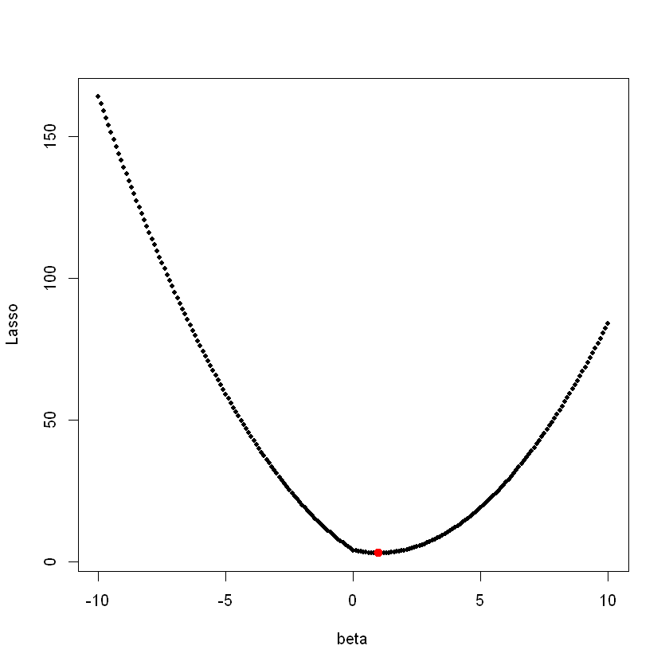
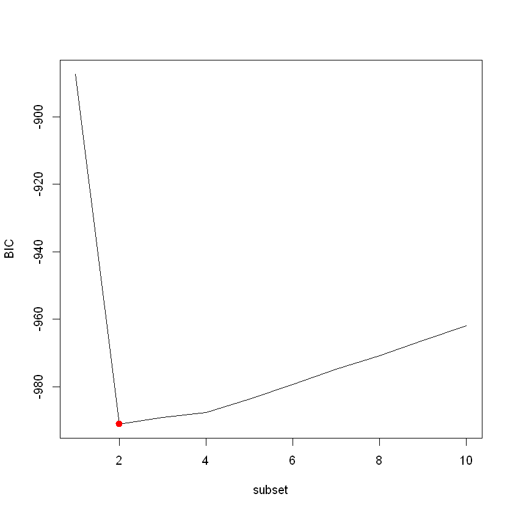
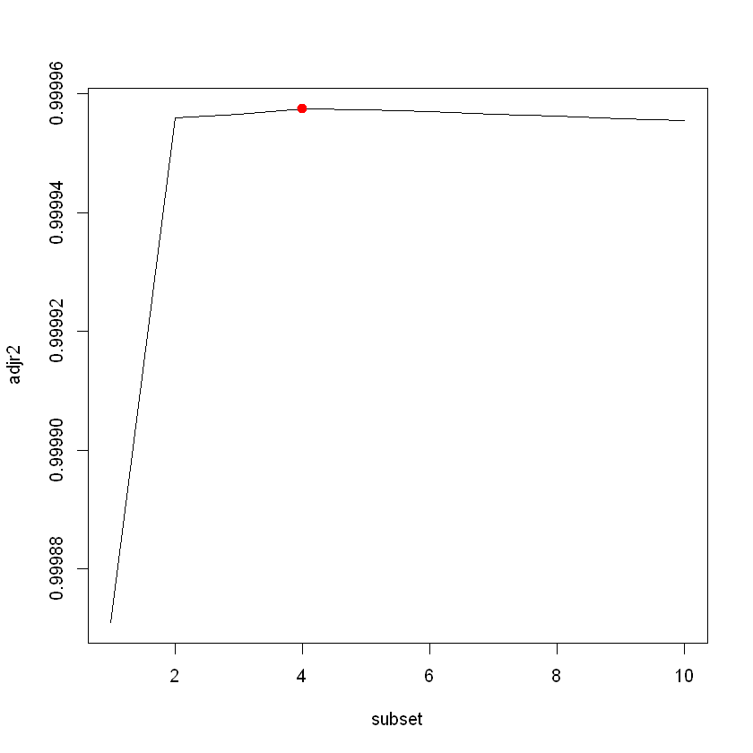
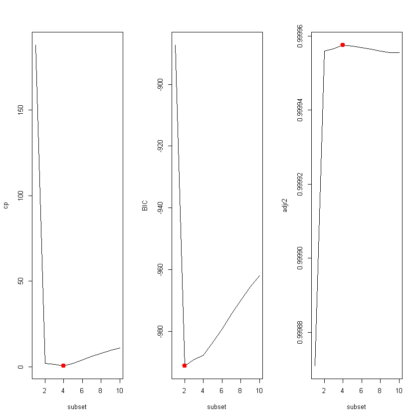
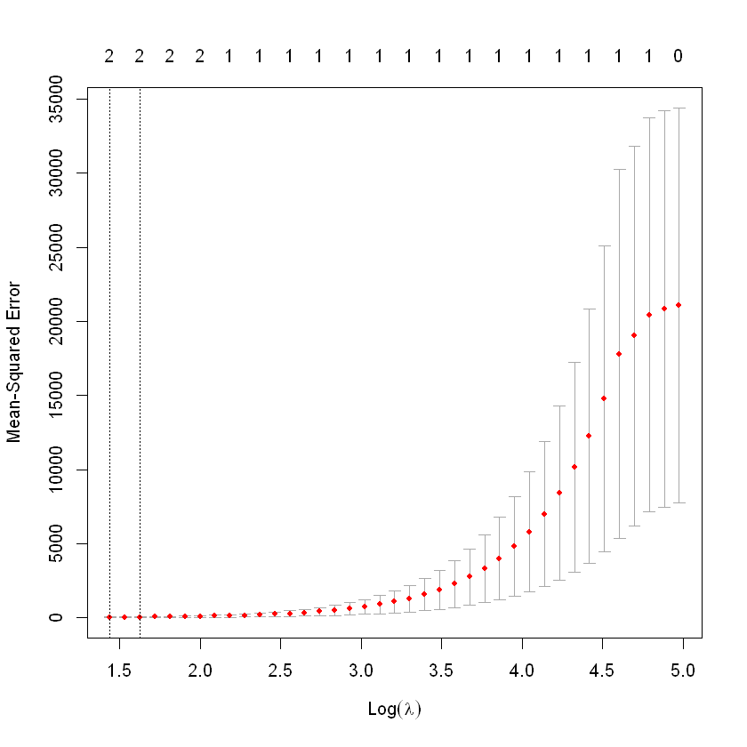
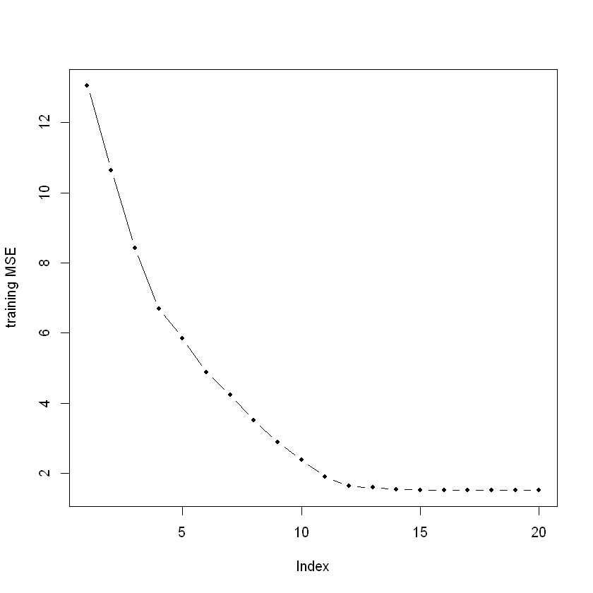
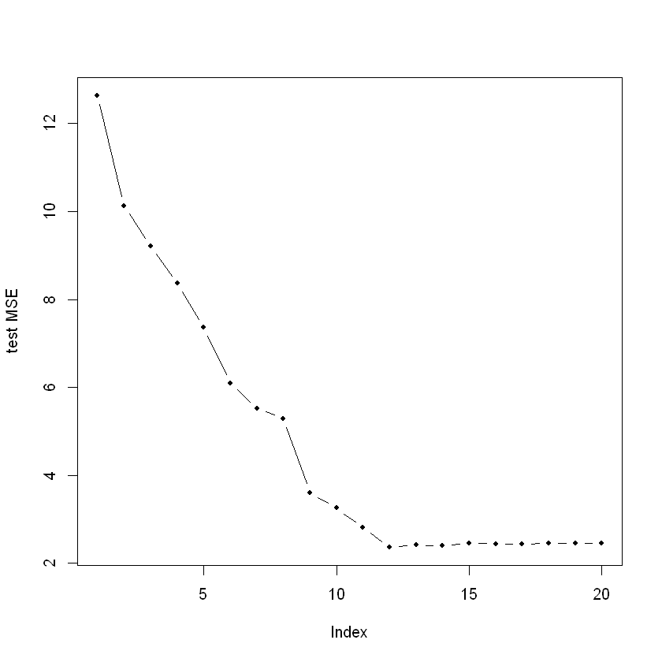
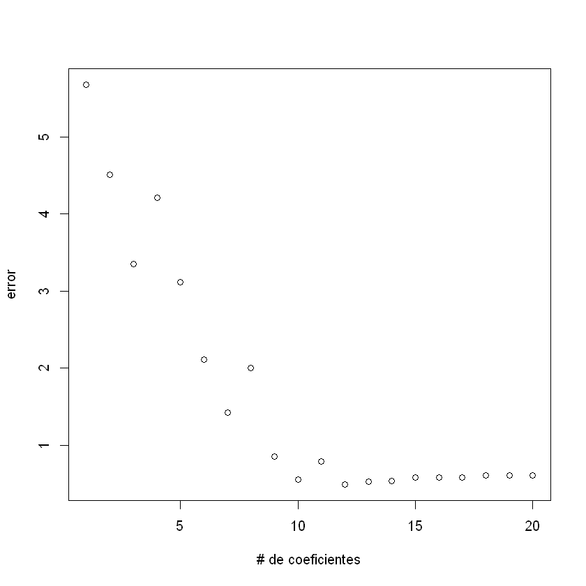

# Capítulo 6
## Santiago Espinoza
## René Delgado


# 6.1

a)   Stepwise and backwardstepwise, si es que tenemo suerte, si no todavía es mejor best subset.

b)   Best Subset.

c)
<ol type="i">
  <li>Veradero</li>
  <li>Veradero</li>
  <li>Veradero</li>
  <li>Veradero</li>
  <li>Falso</li>
</ol>

# 6.2

a)   
la iii. es verdadera. Lasso tiene menor flexibilidad, menor varianza y mayor sezgo.

b)  
la iii. tambien aplica para Ridge.

c)  
la ii. es verdadera. Los modelos no lineales son más flexibles y tienen varianza alta y sezgo bajo.

# 6.3
a)   La respuesta es i debido a que en los extremos tienen demasiado bias o demasiada varianza.

b)   La respuesta es i debido a que en los extremos tienen demasiado bias o demasiada varianza.

c)   Steadily decrease, debido a la reducción sobre los coeficientes.

d)   Steadily increase, debido a que estamos despresiando coeficientes.

e) Se manteine constante.


# 6.4

a)  
La iii. es verdadera. Al incrementar $\lambda$ de $0$ el $RSS$ de entrenamiento incrementará ya que las $\beta$´s se irán reduciendo a $0$.

b)  
La ii. es verdadera. El $RSS$ de prueba decrementará al inicio, pero luego crecerá. En $\lambda = 0$, el modelo tratará de apegarse a los datos de entrenamiento, por lo que habrá overfitting y el RSS será grande. Conforme se incrementa $\lambda$, las $\beta$´s se irán reduciendo a $0$, y se reducirá el overfitting, por lo que el RSS decrecerá. Conforme las $\beta$´s se acerquen más a $0$, se comenzara a simplificar el modelo y el $RSS$ de prueba comenzará a incrementar.

c)  
la iv. es verdadera. Conforme se aumenta $\lambda$, las $\beta$´s decrementan y el modelo se simplifica, por lo que la varianza disminuye. En $\lambda \rightarrow \infty$, las $\beta$´s son $0$ y no hay varianza.

d)  
la ii. es verdadera. En $\lambda = 0$ el modelo tine el menor sezgo posible. Conforme aumenta $\lambda$ el ajuste del modelo se aleja de los datos de entrenamiento y por tanto aumenta el sezgo. En $\lambda \rightarrow \infty$, el sezgo es máximo.

e)  
La v. es verdadera. El error irreducible no depene del modelo, por tanto no cambiará.
# 6.5
a)

$$  minimizado [ (y_1 - a(\beta_1  + \beta_2)) ^2 +(-y_1 + a(\beta_1  + \beta_2)) ^2 + \lambda (\beta_1^2+\beta_2^2)]$$
$$  minimizado [ 2(y_1 - a(\beta_1  + \beta_2)) ^2   + \lambda (\beta_1^2+\beta_2^2)]$$

Derivando e igualando a cero para ambas betas resulta la ecuación:
$$
  2\lambda(\beta_1-\beta_2)=0
$$
b) Por lo tanto las betas deben de ser iguales, para que se cumpla la ecuación anterior.
c)
$$  minimizado [ 2(y_1 - a(\beta_1  + \beta_2)) ^2   + \lambda (|\beta_1|+|\beta_2|)]$$
 Da: $$ \lambda(\frac{\beta_1}{|\beta_1|}-\frac{\beta_2}{|\beta_2|})=0$$

d) La ecuación anterior implica que $\frac{\beta_1}{|\beta_1|}=\frac{\beta_2}{|\beta_2|}$, y esto se cumple siempre que las betas tengan el mismo signo. Por lo que beta 1 y beta 2 no tienen el mismo valor único.
# 6.6

a)  
Para $p=1$ tenemos que $(6.12)$ tiene la forma $(y-\beta)^2 + \beta \lambda^2$ y se grafica para $y=2, \lambda = 2$.


```R
y = 2
lambda = 2
b = seq(-10,10,0.1)
f = (y-b)^2 + lambda*b^2
plot(b,f,pch = 20, xlab = "beta",ylab = "Ridge")
est.b = y/(1+lambda)
est.f = (y-est.b)^2+lambda*est.b^2
points(est.b,est.f,col = "red",pch = 20,lwd = 5)
```


El punto rojo indica el mínimo, el cual sí esta dado por $\beta = y/(1+\lambda)$  

b)
Para $p=1$, $(6.13)$ tiene la forma $(y-\beta)^2+\lambda |\beta|$, y se grafica para $y=2, \lambda = 2$.


```R
y = 2
lambda = 2
b = seq(-10,10,0.1)
f = (y-b)^2 + lambda*abs(b)
plot(b,f,pch=20,xlab = "beta",ylab = "Lasso")
est.b = y-lambda/2
est.f = (y-est.b)^2+lambda*abs(est.b)
points(est.b,est.f,col="red",pch = 20,lwd = 5)
```





El punto rojo es el mínimo, y si es $\beta = y-\lambda/2$
# 6.7

# 6.8
a)


```R
set.seed(1)
X = rnorm(100)
e = rnorm(100)
```

b)  
$Y=\beta_0 + \beta_1X + \beta_2X^2+\beta_3X^3 + \epsilon $


```R
beta0 = 1
beta1 = 2
beta2 = 3
beta3 = 4

Y = beta0 + beta1 * X + beta2 * X^2 * beta3 * X^3 + e
```

c)


```R
library(leaps)
data = data.frame(y = Y, x = X)
modelo = regsubsets(y~poly(x,10,raw = T),data = data,nvmax = 10)
sum.modelo = summary(modelo)
```


```R
# Modelo para mejor cp,BIC y adjr2
min.cp = which.min(sum.modelo$cp)
min.cp
plot(sum.modelo$cp,xlab = "subset",ylab = "cp",pch = 20, type = "l")
points(min.cp,sum.modelo$cp[min.cp],pch = 20,col="red",lwd = 5)
```


4


```R
min.bic = which.min(sum.modelo$bic)
min.bic
plot(sum.modelo$bic,xlab = "subset",ylab = "BIC",pch = 20, type = "l")
points(min.bic,sum.modelo$bic[min.bic],pch = 20,col="red",lwd = 5)
```


2





```R
max.r = which.max(sum.modelo$adjr2)
max.r
plot(sum.modelo$adjr2,xlab = "subset",ylab = "adjr2",pch = 20, type = "l")
points(max.r,sum.modelo$adjr2[max.r],pch = 20,col="red",lwd = 5)
```


4





```R
coef(modelo,min.cp)
coef(modelo,min.bic)
coef(modelo,max.r)
```


<style>
.dl-inline {width: auto; margin:0; padding: 0}
.dl-inline>dt, .dl-inline>dd {float: none; width: auto; display: inline-block}
.dl-inline>dt::after {content: ":\0020"; padding-right: .5ex}
.dl-inline>dt:not(:first-of-type) {padding-left: .5ex}
</style><dl class=dl-inline><dt>(Intercept)</dt><dd>1.07200774585594</dd><dt>poly(x, 10, raw = T)1</dt><dd>2.38745595852041</dd><dt>poly(x, 10, raw = T)2</dt><dd>-0.154243589624806</dd><dt>poly(x, 10, raw = T)3</dt><dd>-0.442025738722733</dd><dt>poly(x, 10, raw = T)5</dt><dd>12.0807229152065</dd></dl>


<style>
.dl-inline {width: auto; margin:0; padding: 0}
.dl-inline>dt, .dl-inline>dd {float: none; width: auto; display: inline-block}
.dl-inline>dt::after {content: ":\0020"; padding-right: .5ex}
.dl-inline>dt:not(:first-of-type) {padding-left: .5ex}
</style><dl class=dl-inline><dt>(Intercept)</dt><dd>0.962852265623081</dd><dt>poly(x, 10, raw = T)1</dt><dd>1.96230857957747</dd><dt>poly(x, 10, raw = T)5</dt><dd>12.0042041082966</dd></dl>


<style>
.dl-inline {width: auto; margin:0; padding: 0}
.dl-inline>dt, .dl-inline>dd {float: none; width: auto; display: inline-block}
.dl-inline>dt::after {content: ":\0020"; padding-right: .5ex}
.dl-inline>dt:not(:first-of-type) {padding-left: .5ex}
</style><dl class=dl-inline><dt>(Intercept)</dt><dd>1.07200774585594</dd><dt>poly(x, 10, raw = T)1</dt><dd>2.38745595852041</dd><dt>poly(x, 10, raw = T)2</dt><dd>-0.154243589624806</dd><dt>poly(x, 10, raw = T)3</dt><dd>-0.442025738722733</dd><dt>poly(x, 10, raw = T)5</dt><dd>12.0807229152065</dd></dl>


De acuerdo con Cp y $R^2$ se tienen como el mejor modelo el de 4 variables, para el caso de BIC se tiene el modelo de 2 variables.

EL moelo con 4 variables elige a $X,X^2,X^3$ y $X^5$, mientras que el modelo de 2 variables elige a $X$ y $X^5$

d)


```R
#Forwards
fwd = regsubsets(y~poly(x,10,raw=T),data=data,nvmax = 10,method = "forward")
sum.fwd = summary(fwd)

min.cp.fwd = which.min(sum.fwd$cp)
min.bic.fwd = which.min(sum.fwd$bic)
max.adjr2.fwd = which.max(sum.fwd$adjr2)

par(mfrow = c(1, 3))

plot(sum.fwd$cp,xlab = "subset",ylab = "cp",pch = 20, type = "l")
points(min.cp.fwd,sum.fwd$cp[min.cp.fwd],pch = 20,col="red",lwd = 5)
plot(sum.fwd$bic,xlab = "subset",ylab = "BIC",pch = 20, type = "l")
points(min.bic.fwd,sum.fwd$bic[min.bic.fwd],pch = 20,col="red",lwd = 5)
plot(sum.fwd$adjr2,xlab = "subset",ylab = "adjr2",pch = 20, type = "l")
points(max.adjr2.fwd,sum.fwd$adjr2[max.adjr2.fwd],pch = 20,col="red",lwd = 5)

coef(fwd,min.cp.fwd)
coef(fwd,min.bic.fwd)
coef(fwd,max.adjr2.fwd)

min.cp.fwd
min.bic.fwd
max.adjr2.fwd
```


<style>
.dl-inline {width: auto; margin:0; padding: 0}
.dl-inline>dt, .dl-inline>dd {float: none; width: auto; display: inline-block}
.dl-inline>dt::after {content: ":\0020"; padding-right: .5ex}
.dl-inline>dt:not(:first-of-type) {padding-left: .5ex}
</style><dl class=dl-inline><dt>(Intercept)</dt><dd>1.07200774585592</dd><dt>poly(x, 10, raw = T)1</dt><dd>2.38745595852048</dd><dt>poly(x, 10, raw = T)2</dt><dd>-0.154243589624778</dd><dt>poly(x, 10, raw = T)3</dt><dd>-0.442025738722776</dd><dt>poly(x, 10, raw = T)5</dt><dd>12.0807229152065</dd></dl>


<style>
.dl-inline {width: auto; margin:0; padding: 0}
.dl-inline>dt, .dl-inline>dd {float: none; width: auto; display: inline-block}
.dl-inline>dt::after {content: ":\0020"; padding-right: .5ex}
.dl-inline>dt:not(:first-of-type) {padding-left: .5ex}
</style><dl class=dl-inline><dt>(Intercept)</dt><dd>0.962852265623078</dd><dt>poly(x, 10, raw = T)1</dt><dd>1.9623085795775</dd><dt>poly(x, 10, raw = T)5</dt><dd>12.0042041082966</dd></dl>


<style>
.dl-inline {width: auto; margin:0; padding: 0}
.dl-inline>dt, .dl-inline>dd {float: none; width: auto; display: inline-block}
.dl-inline>dt::after {content: ":\0020"; padding-right: .5ex}
.dl-inline>dt:not(:first-of-type) {padding-left: .5ex}
</style><dl class=dl-inline><dt>(Intercept)</dt><dd>1.07200774585592</dd><dt>poly(x, 10, raw = T)1</dt><dd>2.38745595852048</dd><dt>poly(x, 10, raw = T)2</dt><dd>-0.154243589624778</dd><dt>poly(x, 10, raw = T)3</dt><dd>-0.442025738722776</dd><dt>poly(x, 10, raw = T)5</dt><dd>12.0807229152065</dd></dl>


4


2


4





Forward con 4 variables elige a $X^2$ y $X^3$. Forward con 2 variables elige a $X$.


```R
#Backwards
bwd = regsubsets(y~poly(x,10,raw=T),data=data,nvmax = 10,method = "backward")
sum.bwd = summary(bwd)

min.cp.bwd = which.min(sum.bwd$cp)
min.bic.bwd = which.min(sum.bwd$bic)
max.adjr2.bwd = which.max(sum.bwd$adjr2)
par(mfrow = c(1, 3))

plot(sum.bwd$cp,xlab = "subset",ylab = "cp",pch = 20, type = "l")
points(min.cp.bwd,sum.bwd$cp[min.cp.bwd],pch = 20,col="red",lwd = 5)
plot(sum.bwd$bic,xlab = "subset",ylab = "BIC",pch = 20, type = "l")
points(min.bic.bwd,sum.bwd$bic[min.bic.bwd],pch = 20,col="red",lwd = 5)
plot(sum.bwd$adjr2,xlab = "subset",ylab = "adjr2",pch = 20, type = "l")
points(max.adjr2.bwd,sum.bwd$adjr2[max.adjr2.bwd],pch = 20,col="red",lwd = 5)

coef(bwd,min.cp.bwd)
coef(bwd,min.bic.bwd)
coef(bwd,max.adjr2.bwd)

min.cp.bwd
min.bic.bwd
max.adjr2.bwd
```


<style>
.dl-inline {width: auto; margin:0; padding: 0}
.dl-inline>dt, .dl-inline>dd {float: none; width: auto; display: inline-block}
.dl-inline>dt::after {content: ":\0020"; padding-right: .5ex}
.dl-inline>dt:not(:first-of-type) {padding-left: .5ex}
</style><dl class=dl-inline><dt>(Intercept)</dt><dd>0.950627949808828</dd><dt>poly(x, 10, raw = T)1</dt><dd>2.3511280545862</dd><dt>poly(x, 10, raw = T)3</dt><dd>-0.388876182486243</dd><dt>poly(x, 10, raw = T)5</dt><dd>12.0674382997048</dd></dl>


<style>
.dl-inline {width: auto; margin:0; padding: 0}
.dl-inline>dt, .dl-inline>dd {float: none; width: auto; display: inline-block}
.dl-inline>dt::after {content: ":\0020"; padding-right: .5ex}
.dl-inline>dt:not(:first-of-type) {padding-left: .5ex}
</style><dl class=dl-inline><dt>(Intercept)</dt><dd>0.96285226562308</dd><dt>poly(x, 10, raw = T)1</dt><dd>1.96230857957751</dd><dt>poly(x, 10, raw = T)5</dt><dd>12.0042041082966</dd></dl>


<style>
.dl-inline {width: auto; margin:0; padding: 0}
.dl-inline>dt, .dl-inline>dd {float: none; width: auto; display: inline-block}
.dl-inline>dt::after {content: ":\0020"; padding-right: .5ex}
.dl-inline>dt:not(:first-of-type) {padding-left: .5ex}
</style><dl class=dl-inline><dt>(Intercept)</dt><dd>1.05440153828734</dd><dt>poly(x, 10, raw = T)1</dt><dd>2.37700110594467</dd><dt>poly(x, 10, raw = T)3</dt><dd>-0.429704569321137</dd><dt>poly(x, 10, raw = T)5</dt><dd>12.0791718754771</dd><dt>poly(x, 10, raw = T)6</dt><dd>-0.146642390763945</dd><dt>poly(x, 10, raw = T)8</dt><dd>0.0568537326442892</dd><dt>poly(x, 10, raw = T)10</dt><dd>-0.00558781739576375</dd></dl>


3


2


6


Backward con 3 variables elige a $X^3$. Con 2 variables se elige a $X$, y con 6 variables se elige a $X^3,X^6$ y $X^{10}$

e)


```R
library(glmnet)
xmat = model.matrix(y~poly(x,10,raw=T),data = data)[,-1]
lasso = cv.glmnet(xmat,Y,alpha=1)
b.lambda = lasso$lambda.min
b.lambda

plot(lasso)
```


4.22327361965489





```R
b.mod = glmnet(xmat,Y,alpha=1)
predict(b.mod,s=b.lambda,type = "coefficients")
```


    11 x 1 sparse Matrix of class "dgCMatrix"
                                    1
    (Intercept)             1.3603482
    poly(x, 10, raw = T)1   .        
    poly(x, 10, raw = T)2   .        
    poly(x, 10, raw = T)3   0.7183963
    poly(x, 10, raw = T)4   .        
    poly(x, 10, raw = T)5  11.5950641
    poly(x, 10, raw = T)6   .        
    poly(x, 10, raw = T)7   .        
    poly(x, 10, raw = T)8   .        
    poly(x, 10, raw = T)9   .        
    poly(x, 10, raw = T)10  .        


El modelo Lasso escoge $X^3$


```R
beta7 = 7
Y = beta0 + beta7 * X^7 + e
d = data.frame(y=Y,x=X)
mod = regsubsets(y~poly(x,10,raw=T),data=d,nvmax = 10)
mod.sum = summary(mod)

min.cp = which.min(mod.sum$cp)
min.cp
min.bic = which.min(mod.sum$bic)
min.bic
max.adjr2 = which.max(mod.sum$adjr2)
max.adjr2

coef(mod,min.cp)
coef(mod,min.bic)
coef(mod,max.adjr2)
```


2


1


4


<style>
.dl-inline {width: auto; margin:0; padding: 0}
.dl-inline>dt, .dl-inline>dd {float: none; width: auto; display: inline-block}
.dl-inline>dt::after {content: ":\0020"; padding-right: .5ex}
.dl-inline>dt:not(:first-of-type) {padding-left: .5ex}
</style><dl class=dl-inline><dt>(Intercept)</dt><dd>1.0704903676263</dd><dt>poly(x, 10, raw = T)2</dt><dd>-0.141708425295704</dd><dt>poly(x, 10, raw = T)7</dt><dd>7.00155518856387</dd></dl>


<style>
.dl-inline {width: auto; margin:0; padding: 0}
.dl-inline>dt, .dl-inline>dd {float: none; width: auto; display: inline-block}
.dl-inline>dt::after {content: ":\0020"; padding-right: .5ex}
.dl-inline>dt:not(:first-of-type) {padding-left: .5ex}
</style><dl class=dl-inline><dt>(Intercept)</dt><dd>0.958940246745048</dd><dt>poly(x, 10, raw = T)7</dt><dd>7.00077047427057</dd></dl>


<style>
.dl-inline {width: auto; margin:0; padding: 0}
.dl-inline>dt, .dl-inline>dd {float: none; width: auto; display: inline-block}
.dl-inline>dt::after {content: ":\0020"; padding-right: .5ex}
.dl-inline>dt:not(:first-of-type) {padding-left: .5ex}
</style><dl class=dl-inline><dt>(Intercept)</dt><dd>1.07625244968326</dd><dt>poly(x, 10, raw = T)1</dt><dd>0.291401607645005</dd><dt>poly(x, 10, raw = T)2</dt><dd>-0.161767130528574</dd><dt>poly(x, 10, raw = T)3</dt><dd>-0.252652678281851</dd><dt>poly(x, 10, raw = T)7</dt><dd>7.00913375439678</dd></dl>


```R
xmat = model.matrix(y ~ poly(x, 10, raw = T), data = d)[, -1]
lasso = cv.glmnet(xmat, Y, alpha = 1)

b.lambda = lasso$lambda.min
b.lambda
```


12.3688375183107


```R
b.mod = glmnet(xmat,Y,alpha=1)
predict(b.mod,s=b.lambda,type = "coefficients")
```


    11 x 1 sparse Matrix of class "dgCMatrix"
                                  1
    (Intercept)            1.820215
    poly(x, 10, raw = T)1  .       
    poly(x, 10, raw = T)2  .       
    poly(x, 10, raw = T)3  .       
    poly(x, 10, raw = T)4  .       
    poly(x, 10, raw = T)5  .       
    poly(x, 10, raw = T)6  .       
    poly(x, 10, raw = T)7  6.796694
    poly(x, 10, raw = T)8  .       
    poly(x, 10, raw = T)9  .       
    poly(x, 10, raw = T)10 .       


Tatno BIC como Lasso toman modelos de 1 sola variable. Sin embargo sus interceptos difieren; 0.96 y 1.8 respectivamente.
# 6.9
a,b)

El error me dio 428.2365 de MSE.
```{r}

library(ISLR)
library (glmnet )

D <- College
D <- D[,-1]
print(dim(D)[1])
print(dim(D)[1]*(2/3))
index <- sample(D[,1],dim(D)[1]*(2/3),replace=FALSE)
D.train <- D[index,]
D.test <- D[-index,]

summary(D)
reg <- lm(Apps~.,D.train)
y_hat <- predict(reg,D.test,interval='prediction',se.fit=TRUE)
print(mean(y_hat$se.fit))


grid =10^ seq (10,-2, length =100)

ridge.mod =glmnet (model.matrix(Apps∼.,D.train),D.train$Apps,alpha =0, lambda =grid)
lasso.mod =glmnet (model.matrix(Apps∼.,D.train),D.train$Apps,alpha =1, lambda =grid)


cv.r <- cv.glmnet (model.matrix(Apps∼.,D.train),D.train$Apps,alpha =0)
cv.l  <- cv.glmnet (model.matrix(Apps∼.,D.train),D.train$Apps,alpha =1)


blr = cv.r$lambda.min
ridge.pred=predict (ridge.mod ,s=blr ,newx=model.matrix(Apps∼.,D.test))
mean(( ridge.pred -D.test$Apps)^2)


bll = cv.l$lambda.min
lasso.pred=predict (lasso.mod ,s=bll,newx=model.matrix(Apps∼.,D.test))
mean(( lasso.pred -D.test$Apps)^2)
```
Usando ridge la labmda fue 374.4288 con un error cuadrado de 1005367.

Usando lasso la labmda fue 16.97 con un error cuadrado de 982832.8.

# 6.10

a)


```R
n = 1000
p = 20
x = matrix(rnorm(n*p),n,p)
B = rnorm(p)
B[2]=0
B[4]=0
B[6]=0
B[8]=0
B[10]=0
e = rnorm(p)
y = x %*% B + e
```

b)


```R
index = sample(seq(1000),100,replace=FALSE)
y.train = y[index,]
y.test = y[-index,]

x.train = x[index,]
x.test = x[-index,]

train = data.frame(x = x.train,y = y.train)
```

c)


```R
reg = regsubsets(y~.,data=train,nvmax = p)
errors = rep(NA,p)

x.cols = colnames(x,do.NULL = FALSE, prefix = "x.")
for(i in 1:p){
    cof = coef(reg, id=i)
    pred = as.matrix(x.train[,x.cols %in% names(cof)]) %*% cof[names(cof) %in% x.cols]
    errors[i] = mean((y.train-pred)^2)
}
plot(errors,ylab = "training MSE",pch = 20, type = "b")
```





d)


```R
errors = rep(NA,p)
for(i in 1:p){
    cof = coef(reg,id = i)
    pred = as.matrix(x.test[,x.cols %in% names(cof)]) %*% cof[names(cof) %in% x.cols]
    errors[i] = mean((y.test-pred)^2)
}
plot(errors,ylab = "test MSE",pch = 20, type = "b")
```





e)


```R
which.min(errors)
```


12


El modelo con 12 variables tiene el MSE más pequeño.

f)


```R
coef(reg,id=12)
```


<style>
.dl-inline {width: auto; margin:0; padding: 0}
.dl-inline>dt, .dl-inline>dd {float: none; width: auto; display: inline-block}
.dl-inline>dt::after {content: ":\0020"; padding-right: .5ex}
.dl-inline>dt:not(:first-of-type) {padding-left: .5ex}
</style><dl class=dl-inline><dt>(Intercept)</dt><dd>0.0543882522028183</dd><dt>x.1</dt><dd>1.24043125688552</dd><dt>x.3</dt><dd>0.995175578563397</dd><dt>x.5</dt><dd>1.13815614567743</dd><dt>x.7</dt><dd>0.614815017358444</dd><dt>x.9</dt><dd>1.4057673788986</dd><dt>x.11</dt><dd>1.04404823334838</dd><dt>x.13</dt><dd>0.922830427670553</dd><dt>x.15</dt><dd>-0.868412971264274</dd><dt>x.16</dt><dd>0.981618194961501</dd><dt>x.17</dt><dd>-0.875376222215272</dd><dt>x.19</dt><dd>-1.94492196238762</dd><dt>x.20</dt><dd>-0.745186752285308</dd></dl>


Casi todos los coeficientes estan cerca de cero salvo por x.1,x.5,x.9,x.11 y x.19

g)


```R
erros = rep(NA,p)
a = rep(NA,p)
b = rep(NA,p)

for (i in 1:p){
    cof = coef(reg, id = i)
    a[i] = length(cof) - 1
    b[i] = sqrt(sum((B[x.cols %in% names(cof)]-cof[names(cof) %in% x.cols])^2)+sum(B[!(x.cols %in% names(cof))])^2)
}
plot(x=a,y=b, xlab = "# de coeficientes",ylab = "error")

which.min(b)

```


12





De nuevo se tiene que el modelo con menor error es aquel que contiene 12 variables.

#3.11
 a,b,c )

Usando Best Bubset y K-folds.
Genero un data frame con todos los posibles modelos resultantes del Best Bubset para cada fold, uso 25 folds, y calculo para cada caso su MSE, por lo que con eso voy a poder comparar posteriormente cual es el mejor subset en general.
```{r}
library(ISLR)
library(MASS)
library(glmnet)
library(leaps)

D <- Boston
D$chas <- as.factor(D$chas)
n=dim(Boston)[1]
k=25
v=dim(Boston)[2]-1
MSE = data.frame("id" = "1","mse" = 1,"vnum" = 1,stringsAsFactors = FALSE)
ver=TRUE
folds <- cut(1:n,k,labels=FALSE)
for (i in 1:k) {
    index <- folds == i
    D.train <- D[!index,]
    D.test <- D[index,]
    regfit.full=regsubsets (crim∼.,data=D.train,nvmax=dim(Boston)[2])
    mat <- summary(regfit.full)$which
    for(r in 1:dim(mat)[1] ){
      id <- names(mat[r,-1])[which(mat[r,-1]==TRUE)]
      reg <- lm(D.train$crim~.,data=D.train[,mat[r,]])
      y_hat <- predict(reg,D.test,interval='prediction',se.fit=TRUE)
      MSE <- rbind(MSE,c(paste(id,collapse=" "),mean(y_hat$se.fit),length(id)))
    }
}
```

```{r}

MSE <- MSE[-1,]
MSE$mse <- as.numeric(MSE$mse)
MSE$vnum <- as.numeric(MSE$vnum)
MSE$id <- as.factor(MSE$id)


```

```{r}
library(dplyr)
MSE[1,]

MSE %>%  group_by(id,vnum) %>% summarize(meanMSE = mean(mse))  %>% arrange(meanMSE,vnum)


```

Los resultados fueron que se encontraron 58 sets totales diferentes que eran los mejores para su numero de variables en los distintos k-folds.

Sin embargo los más presentes, aquellos que se encuentran en la mayoría d elos folds fueron:

<table cellspacing="0" class="table table-condensed" style="min-width:100%">
  <thead>
    <tr>
      <th align="left" style="text-align: left; max-width: 60%; min-width: 60%; border-bottom-color: rgba(0, 0, 0, 0.12);">
        <div class="pagedtable-header-name">id</div>
      </th>
      <th align="right" style="text-align: right; max-width: 10%; min-width: 10%; border-bottom-color: rgba(0, 0, 0, 0.12);">
        <div class="pagedtable-header-name">vnum</div>
      </th>
      <th align="right" style="text-align: right; max-width: 20%; min-width: 20%; border-bottom-color: rgba(0, 0, 0, 0.12);">
        <div class="pagedtable-header-name">meanMSE</div>
      </th>
      <th align="right" style="text-align: right; max-width: 10%; min-width: 10%; border-bottom-color: rgba(0, 0, 0, 0.12);">
        <div class="pagedtable-header-name">countID</div>
      </th>
    </tr>
  </thead>
  <tbody>
    <tr class="odd">
      <td align="left" style="text-align: left; max-width: 60%; min-width: 60%; border-bottom-color: rgba(0, 0, 0, 0.12);">rad</td>
      <td align="right" style="text-align: right; max-width: 10%; min-width: 10%; border-bottom-color: rgba(0, 0, 0, 0.12);">1</td>
      <td align="right" style="text-align: right; max-width: 20%; min-width: 20%; border-bottom-color: rgba(0, 0, 0, 0.12);">0.4233392</td>
      <td align="right" style="text-align: right; max-width: 10%; min-width: 10%; border-bottom-color: rgba(0, 0, 0, 0.12);">25</td>
    </tr>
    <tr class="even" style="background-color: rgba(0, 0, 0, 0.02);">
      <td title="zn indus chas1 nox rm age dis rad tax ptratio black lstat medv" align="left" style="text-align: left; max-width: 60%; min-width: 60%; border-bottom-color: rgba(0, 0, 0, 0.12);">zn indus chas1 nox rm age dis rad tax ptratio black
        lstat medv</td>
      <td align="right" style="text-align: right; max-width: 10%; min-width: 10%; border-bottom-color: rgba(0, 0, 0, 0.12);">13</td>
      <td align="right" style="text-align: right; max-width: 20%; min-width: 20%; border-bottom-color: rgba(0, 0, 0, 0.12);">1.1721844</td>
      <td align="right" style="text-align: right; max-width: 10%; min-width: 10%; border-bottom-color: rgba(0, 0, 0, 0.12);">25</td>
    </tr>
    <tr class="odd">
      <td align="left" style="text-align: left; max-width: 60%; min-width: 60%; border-bottom-color: rgba(0, 0, 0, 0.12);">rad lstat</td>
      <td align="right" style="text-align: right; max-width: 10%; min-width: 10%; border-bottom-color: rgba(0, 0, 0, 0.12);">2</td>
      <td align="right" style="text-align: right; max-width: 20%; min-width: 20%; border-bottom-color: rgba(0, 0, 0, 0.12);">0.4856907</td>
      <td align="right" style="text-align: right; max-width: 10%; min-width: 10%; border-bottom-color: rgba(0, 0, 0, 0.12);">23</td>
    </tr>
    <tr class="even" style="background-color: rgba(0, 0, 0, 0.02);">
      <td align="left" style="text-align: left; max-width: 60%; min-width: 60%; border-bottom-color: rgba(0, 0, 0, 0.12);">rad black lstat</td>
      <td align="right" style="text-align: right; max-width: 10%; min-width: 10%; border-bottom-color: rgba(0, 0, 0, 0.12);">3</td>
      <td align="right" style="text-align: right; max-width: 20%; min-width: 20%; border-bottom-color: rgba(0, 0, 0, 0.12);">0.5247603</td>
      <td align="right" style="text-align: right; max-width: 10%; min-width: 10%; border-bottom-color: rgba(0, 0, 0, 0.12);">22</td>
    </tr>
    <tr class="odd">
      <td title="zn indus chas1 nox rm dis rad tax ptratio black lstat medv" align="left" style="text-align: left; max-width: 60%; min-width: 60%; border-bottom-color: rgba(0, 0, 0, 0.12);">zn indus chas1 nox rm dis rad tax ptratio black lstat
        medv</td>
      <td align="right" style="text-align: right; max-width: 10%; min-width: 10%; border-bottom-color: rgba(0, 0, 0, 0.12);">12</td>
      <td align="right" style="text-align: right; max-width: 20%; min-width: 20%; border-bottom-color: rgba(0, 0, 0, 0.12);">1.1238416</td>
      <td align="right" style="text-align: right; max-width: 10%; min-width: 10%; border-bottom-color: rgba(0, 0, 0, 0.12);">22</td>
    </tr>
    <tr class="even" style="background-color: rgba(0, 0, 0, 0.02);">
      <td align="left" style="text-align: left; max-width: 60%; min-width: 60%; border-bottom-color: rgba(0, 0, 0, 0.12);">zn dis rad medv</td>
      <td align="right" style="text-align: right; max-width: 10%; min-width: 10%; border-bottom-color: rgba(0, 0, 0, 0.12);">4</td>
      <td align="right" style="text-align: right; max-width: 20%; min-width: 20%; border-bottom-color: rgba(0, 0, 0, 0.12);">0.6619813</td>
      <td align="right" style="text-align: right; max-width: 10%; min-width: 10%; border-bottom-color: rgba(0, 0, 0, 0.12);">20</td>
    </tr>
    <tr class="odd">
      <td align="left" style="text-align: left; max-width: 60%; min-width: 60%; border-bottom-color: rgba(0, 0, 0, 0.12);">zn dis rad black medv</td>
      <td align="right" style="text-align: right; max-width: 10%; min-width: 10%; border-bottom-color: rgba(0, 0, 0, 0.12);">5</td>
      <td align="right" style="text-align: right; max-width: 20%; min-width: 20%; border-bottom-color: rgba(0, 0, 0, 0.12);">0.7081495</td>
      <td align="right" style="text-align: right; max-width: 10%; min-width: 10%; border-bottom-color: rgba(0, 0, 0, 0.12);">19</td>
    </tr>
    <tr class="even" style="background-color: rgba(0, 0, 0, 0.02);">
      <td align="left" style="text-align: left; max-width: 60%; min-width: 60%; border-bottom-color: rgba(0, 0, 0, 0.12);">zn indus nox dis rad ptratio black lstat medv</td>
      <td align="right" style="text-align: right; max-width: 10%; min-width: 10%; border-bottom-color: rgba(0, 0, 0, 0.12);">9</td>
      <td align="right" style="text-align: right; max-width: 20%; min-width: 20%; border-bottom-color: rgba(0, 0, 0, 0.12);">0.9573117</td>
      <td align="right" style="text-align: right; max-width: 10%; min-width: 10%; border-bottom-color: rgba(0, 0, 0, 0.12);">17</td>
    </tr>
    <tr class="odd">
      <td align="left" style="text-align: left; max-width: 60%; min-width: 60%; border-bottom-color: rgba(0, 0, 0, 0.12);">zn nox dis rad black medv</td>
      <td align="right" style="text-align: right; max-width: 10%; min-width: 10%; border-bottom-color: rgba(0, 0, 0, 0.12);">6</td>
      <td align="right" style="text-align: right; max-width: 20%; min-width: 20%; border-bottom-color: rgba(0, 0, 0, 0.12);">0.7272673</td>
      <td align="right" style="text-align: right; max-width: 10%; min-width: 10%; border-bottom-color: rgba(0, 0, 0, 0.12);">15</td>
    </tr>
    <tr class="even" style="background-color: rgba(0, 0, 0, 0.02);">
      <td align="left" style="text-align: left; max-width: 60%; min-width: 60%; border-bottom-color: rgba(0, 0, 0, 0.12);">zn nox dis rad ptratio black medv</td>
      <td align="right" style="text-align: right; max-width: 10%; min-width: 10%; border-bottom-color: rgba(0, 0, 0, 0.12);">7</td>
      <td align="right" style="text-align: right; max-width: 20%; min-width: 20%; border-bottom-color: rgba(0, 0, 0, 0.12);">0.8239574</td>
      <td align="right" style="text-align: right; max-width: 10%; min-width: 10%; border-bottom-color: rgba(0, 0, 0, 0.12);">15</td>
    </tr>
  </tbody>
</table>


Además en general el mejor modelo fue el que utiliza solamente rad como preditor con el menor MSE de entre todos los k-folds, le sigue rad lstat para el modelo con dos variebles y rad black lstat para el modelo con tres variables.

Este método toma en cuenta todolos los posibles modelos para cada k-fold y encuentra el mejor, para mejorar podría no usar k-folds y usar algún método más exaustivo para generar la validación cruzada.
